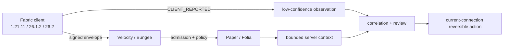

# MCAce

MCAce is a privacy-first trust, admission, evidence, and reversible-disposition
stack for modern Minecraft networks. The release surface is intentionally small:
Fabric client Mods, Velocity/BungeeCord proxy plugins, and one Paper/Folia
backend plugin.

> **v0.0.1 status: release gates still open.** The code and server matrix are
> active, but the tag is not claimed until all six visible GUI decisions (two per
> target), a genuine licensed Vulcan event, and a real Fabric federation handoff
> are recorded on the
> reviewed commit.

[中文 README](README_CN.md) · [release gates](docs/RELEASE_GATES.md) ·
[security model](docs/SECURITY.md) · [anti-cheat evidence](docs/evidence/anti-cheat-real-server-2026-08-23.json) · [current Helio recheck](docs/evidence/real-server-2026-08-23/rerun-2026-08-23.json) · [current-candidate Helio run](docs/evidence/real-server-2026-08-23/current-candidate-fe5f2d1.json)
· [Helio static-suite evidence](docs/evidence/cluster-helio-static-suite-2026-08-22.json)
· [latest Helio static-suite evidence](docs/evidence/cluster-helio-static-suite-2026-08-22-33878f2.json)
· [current-head regression evidence](docs/evidence/static-regression-2026-08-23.json)
· [current HEAD Helio Paper test](docs/evidence/cluster-helio-cc91c63-paper-test-2026-08-23.json)
· [current HEAD Helio static wrappers](docs/evidence/cluster-helio-cd3921c-static-2026-08-23.json)
· [active-pack iteration evidence](docs/evidence/active-pack-integrity-2026-08-22.json)
· [historical e7f6f74 release-bundle evidence](docs/evidence/release-bundle-e7f6f74.json)
· [current Helio 12/12 server matrix evidence](docs/evidence/server-version-process-matrix-2026-08-25-65731aa.json)
· [latest feature exact-commit CI evidence](docs/evidence/github-feature-ci-2026-08-25-63ae400.json)
· [current Helio exact-source release-bundle evidence](docs/evidence/release-bundle-2026-08-25-63ae400.json)
· [current fail-closed readiness report](docs/evidence/release-readiness-2026-08-25-286083f.json)
· [GitHub branch/tag protection evidence](docs/evidence/github-protection-2026-08-25.json)
· [D-drive migration record](docs/PROJECT_MIGRATION.md)


## Scope and privacy contract

- Fabric client Mods: `1.21.11`, `26.1.2`, and `26.2`.
- Velocity and BungeeCord proxy plugins.
- Paper/Folia backend plugin.
- Default mode is `MONITOR`; client-origin facts are advisory and cannot punish
  a player alone.
- Screenshots/file evidence require an explicit, visible consent decision.
- `DENY` is connection-scoped, reviewable, and reversible; there is no automatic
  permanent BAN.
- No launcher, agent, kernel driver, hidden capture, keylogging,
  camera/microphone access, arbitrary packet exploit, or mandatory cloud service
  is in the release boundary.

## Compatibility allowlist

Compatibility is an exact tuple contract, not a protocol-number guess.


| Minecraft | Protocol | Java | Fabric Loader | Fabric API | Client artifact |
| --- | ---: | ---: | --- | --- | --- |
| `1.21.11` | `774` | `21` | `0.19.3` | `0.141.6+1.21.11` | final remapped JAR |
| `26.1.2` | `775` | `25` | `0.19.3` | `0.155.2+26.1.2` | final named JAR |
| `26.2` | `776` | `25` | `0.19.3` | `0.157.0+26.2` | final named JAR |

`1.21.11` is the only verified `1.21.x` tuple. Unlisted patches fail closed.
Run the contract against a current bundle:

```powershell
.\scripts\version-compatibility-contract-smoke.ps1 -Execute
.\scripts\version-compatibility-contract-smoke.ps1 -ReportOnly `
  -ReportPath .\build\compatibility-contract\report.json
```

## Evidence dashboard

| Gate | Current evidence | State |
| --- | --- | --- |
| Root + modern strict offline tests | Historical exact bundle: `171 suites / 755 tests / 0 failures / 0 errors`; [Helio targeted build evidence](docs/evidence/cluster-targeted-build-2026-08-22.json) ran Fabric, Velocity, BungeeCord, Paper, and runtime integration tests successfully | PASS within recorded source boundary |
| Current-head regression suite | [473ef5b evidence](docs/evidence/static-regression-2026-08-24-473ef5b.json) and the Helio wrapper records remain retained as historical witnesses; the feature branch now has documentation-only commits after the tested code commit `65731aa…`, while the resumable server-matrix static test and Helio execution remain bound to that code commit | PASS for the recorded checks; fresh protected-main release CI is still pending |
| Paper/Folia × Velocity/Bungee process matrix | [Helio evidence index](docs/evidence/server-version-process-matrix-2026-08-25-65731aa.json) plus the immutable [report](docs/evidence/server-version-process-matrix/2026-08-25T00-54-47-3783015Z/report.json), [binding](docs/evidence/server-version-process-matrix/2026-08-25T00-54-47-3783015Z/binding.json), and [commit marker](docs/evidence/server-version-process-matrix/2026-08-25T00-54-47-3783015Z/commit.json): exact feature commit `65731aa…`, `12/12`, `10` STABLE + `2` BETA, cleanup zero, source manifest `a97a9a83…` / 688 files; Paper 26.2 build `116`, Folia 26.2 build `6` | PASS on Helio; protected-main release CI still pending |
| Fabric GUI consent | 1.21.11 reached the visible explicit-file screen; no click was recorded, so no release evidence was minted | PENDING 6 human decisions |
| Anti-cheat detection | [`current-candidate-fe5f2d1.json`](docs/evidence/real-server-2026-08-23/current-candidate-fe5f2d1.json) binds the exact Paper artifact SHA used by the historical e7f6f74 bundle to a Helio run on real Leaf 1.21.11 + GrimAC `2.3.74-155abaf`: 40 movement probes, three `SERVER_CONFIRMED` `BEHAVIOR_HIGH_RISK` events (`AimDuplicateLook`, `Simulation`, `TickTimer`), and three loopback risk uploads; the runtime record is source-bound to `fe5f2d1…`, while the Paper JAR bytes are identical in the historical manifest | PASS for real observational detection/correlation/upload; `MONITOR`/`NONE` intentionally leaves punitive action unexercised |
| Vulcan | Static contracts pass; licensed JAR and genuine external trigger are absent from this workspace | PENDING |
| Fabric federation | V2 static contract passes; source-export/target-import GUI handoff has not been executed | PENDING |
| Exact-commit CI/release | [Push run `32798326193`](https://github.com/TypeThe0ry/MCAce/actions/runs/32798326193) and [PR run `32798329912`](https://github.com/TypeThe0ry/MCAce/actions/runs/32798329912) passed for exact source `63ae400adc8d09d8349ca599c9d6a4866a189d04`: build/test, local verification bundle, and exact-eight upload passed; protected branch/tag releaseBundle and readiness gates are intentionally reserved for `main`/`v0.0.1` refs. See [sanitized evidence](docs/evidence/github-feature-ci-2026-08-25-63ae400.json). | PASS for the current feature witness; protected branch/tag exact-commit release remains pending |
| Helio exact-source release bundle | [current evidence](docs/evidence/release-bundle-2026-08-25-63ae400.json) records a successful Helio `clean build releaseBundle` for exact source `63ae400adc8d09d8349ca599c9d6a4866a189d04`, `product_version=0.0.1`, six deployables/eight entries, exact SHA256SUMS, and 3/3 compatibility contract; Gradle daemon was constrained without contaminating runtime child stdout | PASS for feature-source artifact candidate; protected-main publication still requires the external gates and main exact-commit CI |
| Historical Helio release candidate | [`release-bundle-e7f6f74.json`](docs/evidence/release-bundle-e7f6f74.json) records Helio `releaseBundle` for `e7f6f74a9d08b6c4cef829b7b5e65ba150f5d834`: six deployables, exact-eight manifest, `product_version=0.0.1`, bundle ZIP SHA-256 `4799733be6a178a7ed119d69f4945453dec1d73fbab7a22e95e51e259e035ded`, and all eight entry hashes verified locally; compatibility contract is 3/3 PASS | Historical feature-branch candidate only; protected `main` CI, external GUI/Vulcan/federation gates, current-source releaseBundle, and final tag remain pending |
| Current release readiness | [`release-readiness-2026-08-25-286083f.json`](docs/evidence/release-readiness-2026-08-25-286083f.json) is generated by the fail-closed gate against source `286083f…`; server-matrix and clean-worktree pass, while the feature Helio bundle remains explicitly `protected_main_exact_commit_ci=false` and the protected branch/tag bundle gate stays closed | BLOCKED: GUI six decisions, federation handoff, Vulcan genuine event, production authority freeze, and protected branch/tag exact-commit bundle remain open; no tag or release is claimed |
| GitHub branch/tag protection | [protection evidence](docs/evidence/github-protection-2026-08-25.json) records strict `main` protection with required `build`, operator-only `v0.0.1` tag creation, and no-bypass tag deletion/update rules | PASS for repository policy; this does not substitute for the release CI run or the external runtime gates |

The latest retained feature exact-commit CI evidence is bound to
`63ae400adc8d09d8349ca599c9d6a4866a189d04`; the current Helio server-matrix
evidence is independently bound to `65731aad2e023473a6a5f971404b86926603a0c0`.
The current HEAD is a documentation/evidence-only
descendant accepted by the provenance gate. The `e7f6f74` Helio release bundle
remains a historical feature-branch candidate, not evidence for the current HEAD.
Verify the source commit used for each artifact with `git rev-parse HEAD`; later documentation-only commits do not change the tested plugin artifact. Do not copy an
artifact to a tag unless its `release-manifest.properties` has
`release_identity=true` and the `source_commit` matches that checkout exactly.
The current v0.0.1 release decision is still controlled by the six human GUI
approvals plus the real anti-cheat, Vulcan, and federation gates below.


## Anti-cheat and feature detection

The pipeline separates origin and confidence:

1. `CLIENT_REPORTED` mod/resource-pack facts are low-confidence observations.
2. Signature, nonce, sequence, expiry, replay, and scope checks reject malformed
   or stale evidence.
3. Correlation can create a review signal only when configured providers and
   windows corroborate it.
4. High-impact actions require a `SERVER_CONFIRMED` producer or durable operator
   authorization. A client load is not a detection or enforcement result.

The active-client telemetry path now includes the runtime-selected resource and
shader pack IDs. Resource-pack changes and active shader-pack changes trigger an
immediate bounded observation update; the server marks each affected entry with
`selected=true|false` and evaluates it through the signed disposition policy.
Shader-loader integration is optional and reflection-only (Iris is supported
without a hard compile dependency); disabled, failed, or unavailable loaders
report an empty shader selection instead of a guessed directory entry.
`NOTICE`/`WARN`/`CHALLENGE` can therefore be automated for a reviewed client
observation, while `LIMIT`/`QUARANTINE`/`DENY` still require an independent
server provider or durable administrator authorization. A configured
Grim/Vulcan adapter enters through `ServerBehaviorCorrelationRuntime`: its
signal must match the same session inside the correlation window before a
durable `SERVER_CONFIRMED` event is returned. See
[`docs/CLIENT_INTEGRITY_POLICY.md`](docs/CLIENT_INTEGRITY_POLICY.md),
[`docs/CLIENT_SELF_PROTECTION.md`](docs/CLIENT_SELF_PROTECTION.md), and the
fail-closed generator at
[`scripts/new-exact-artifact-policy.ps1`](scripts/new-exact-artifact-policy.ps1)
for the exact-hash/content-root workflow and trust-state table.

The retained real Leaf/GrimAC probe is a separate historical witness and is
source-bound to `fe5f2d1…`; it used the same Paper artifact SHA as the older
`e7f6f74` candidate. The current Helio server matrix is source-bound to
`65731aad2e023473a6a5f971404b86926603a0c0` and does not silently inherit that
anti-cheat run's provenance.
Node.js v22.23.2 completed the probe; the Helio Node.js v24.18.0 image crashed
before producing a result and is retained only as a diagnostic limitation. No
tag or GitHub release has been created. The source workspace was migrated to
`D:\Projects\MCAce`; the original `C:\Users\admin\MCAce` directory was removed
only after exact file/byte and RoboCopy dry-run verification, as recorded in
[`docs/PROJECT_MIGRATION.md`](docs/PROJECT_MIGRATION.md).

The controlled fixture command is metadata-only and does not execute third-party
code:

```powershell
.\scripts\anticheat-fixture-smoke.ps1 -Execute `
  -MinecraftVersion 1.21.11 `
  -MeteorJar 'C:\fixtures\meteor-client.jar' -MeteorSha256 '<sha256>' `
  -XrayPack 'C:\fixtures\Spectator_Xray_1.2.1.zip' -XraySha256 '<sha256>'
```

The retained real-client record proves client discovery/resource loading only.
It explicitly records `real_server_connection=false`,
`real_server_detection_event=false`, and
`real_server_enforcement_exercised=false`; therefore this repository currently
does not claim detection precision, kick/DENY efficacy, or BAN efficacy.

## Build and test

Root modules use JDK 21; the isolated modern clients use JDK 25. Keep the build
offline and dependency verification strict:

```powershell
$env:JAVA_HOME = '<JDK 21 home>'
.\gradlew.bat clean build localVerificationBundle `
  "-PmcaceSourceCommit=$(git rev-parse HEAD)" `
  "-PmcaceModernJavaHome=<JDK 25 home>" `
  --offline --dependency-verification=strict --rerun-tasks `
  --no-build-cache --no-configuration-cache --no-daemon `
  --no-parallel --max-workers=1 --console=plain
```

Server process verification:

```powershell
.\scripts\server-version-process-matrix.ps1 -Execute
.\scripts\server-version-process-matrix.ps1 -ReportOnly
```

To reduce controller load, meaningful compile/test jobs are dispatched to the
configured cluster. The latest verified remote job ran on **Helio** (Windows,
JDK 21, RTX 4070 host) with explicit Gradle JVM settings
`-Xmx2G -XX:TieredStopAtLevel=1`; it completed in about 3m50s with exit code 0. The
sanitized record is [`cluster-targeted-build-2026-08-22.json`](docs/evidence/cluster-targeted-build-2026-08-22.json).
The remote checkout was a sanitized tree-equivalent snapshot of the reviewed
commit. Credentials and worker paths are never copied into the repository.

## Manual GUI gates

Each target requires two visible decisions: explicit-file consent and a separate
`GAME_RENDER_FRAME` evidence consent. The runner waits for a human click and
records the screen stage, decision, artifact hash, cleanup, and binding. It does
not synthesize input:

```powershell
$env:JAVA_HOME = '<JDK 21 or JDK 25 home for the target>'
.\scripts\platform-load-smoke.ps1 -FabricTarget 1.21.11 -WithFabricEvidence -ManualConsentTimeoutSeconds 120
.\scripts\platform-load-smoke.ps1 -FabricTarget 26.1.2 -WithFabricEvidence -ManualConsentTimeoutSeconds 120
.\scripts\platform-load-smoke.ps1 -FabricTarget 26.2 -WithFabricEvidence -ManualConsentTimeoutSeconds 120
```

Use `-ReportOnly` with the emitted report/binding hashes after each successful
run. A timeout report is diagnostic-only and cannot be promoted to release
evidence.

## Vulcan and federation gates

Vulcan requires an operator-supplied licensed JAR, current-source structural
preflight, isolated Paper enablement, and one externally triggered genuine event.
MCAce never downloads or redistributes that artifact. The genuine-event wrapper
rejects synthetic event injection and records only sanitized evidence.

Federation requires source export consent, source disconnect, direct target
connection, target import consent, subject binding, expiry observation, and
zero residual owned processes/ports. Static tests are not a handoff result.

## Release artifacts

The exact distribution is eight entries: six deployable JARs,
`release-manifest.properties`, and `SHA256SUMS`. Hashes must come from the clean
exact-commit `releaseBundle`; do not paste hashes from an older build into a
release note.
The current Helio candidate carries Gradle `product_version=0.0.1` and
`release_identity=true`, but the `v0.0.1` label is not promoted to a tag while
the external release gates remain open.

| Entry | Role |
| --- | --- |
| `mcace-client-fabric-1.21.11.jar` | Fabric 1.21.11 client |
| `mcace-client-fabric-26.1.2.jar` | Fabric 26.1.2 client |
| `mcace-client-fabric-26.2.jar` | Fabric 26.2 client |
| `mcace-server-velocity.jar` | Velocity proxy plugin |
| `mcace-server-bungeecord.jar` | BungeeCord proxy plugin |
| `mcace-server-paper.jar` | Paper/Folia backend plugin |
| `release-manifest.properties` | exact source/runtime identity |
| `SHA256SUMS` | authoritative JAR hashes |

## Architecture



## Repository map

| Module | Responsibility |
| --- | --- |
| `mcace-protocol` | wire contract, signing, replay defense |
| `mcace-core` | sessions, policy, risk, disposition, federation |
| `mcace-client-common` | loader-neutral integrity/evidence primitives |
| `mcace-client-fabric` | 1.21.11 client and consent UI |
| `fabric-modern` | JDK25 official-namespace clients |
| `mcace-server-velocity` / `mcace-server-bungeecord` | proxy adapters |
| `mcace-server-paper` | Paper/Folia adapter |
| `scripts/` | fail-closed build, asset, compatibility, and evidence gates |

More detail: [architecture](docs/ARCHITECTURE.md), [operations](docs/OPERATIONS.md),
[platform testing](docs/PLATFORM_TESTING.md), [release gates](docs/RELEASE_GATES.md),
[security](docs/SECURITY.md), and [federation](docs/FEDERATION.md).
