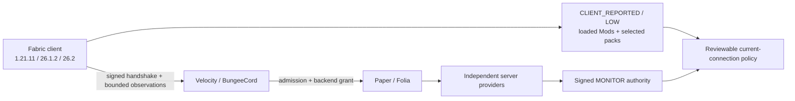

# MCAce

MCAce is a privacy-first client visibility, admission, evidence, and reversible-
disposition stack for modern Minecraft networks. Its deployable surface is a
Fabric client Mod, Velocity/BungeeCord proxy plugins, and one Paper/Folia backend
plugin.

> ## v0.0.1 — RELEASE LOCKED
>
> **No tag or GitHub Release is claimed.** Release remains locked until all seven
> fail-closed gates below validate for one reviewed exact source. The current
> readiness run has Matrix V4 and the clean-worktree gate passing; MCAce still
> needs a current-source visible connection-bound `Enable MCAce` decision inside
> a real Federation V5 handoff, a supervisor-signed licensed Vulcan V3 genuine
> event, an externally captured Production Authority V4 MONITOR package, and
> protected-main/tag V4 exact-commit CI. Decline, close, timeout, or missing
> consent leaves MCAce disabled.

[中文 README](README_CN.md) · [architecture](docs/ARCHITECTURE.md) ·
[security model](docs/SECURITY.md) · [release gates](docs/RELEASE_GATES.md) ·
[operations](docs/OPERATIONS.md) · [current progress ledger](docs/evidence/PROGRESS_2026-09-05.md)


## Release status: exact seven gates

These names match `scripts/release-readiness.ps1`. A controlled fixture, a
historical PASS, a caller Boolean, or an unsigned report cannot promote any gate.

| Readiness gate | Required release evidence | State |
| --- | --- | --- |
| `server_matrix_exact_source` | Matrix V4 seven-root native package; exactly 12 raw process cases; process-incarnation and cleanup commitments; protected V4 release bundle and three server-JAR cross-bindings; out-of-repository RSA supervisor root, protected pin, fresh detached receipt, replay and TOCTOU validation | **PASS for `67ff44b1…`; re-check at final release commit** |
| `fabric_gui_single_enablement_confirmation` | One human-origin, visible, connection-bound `Enable MCAce` decision for the entire v0.0.1 release acceptance; signed GUI attestation and decoded PNG inside the Federation V5 evidence set | **PENDING** |
| `fabric_federation_real_handoff` | Federation V5 source-to-target handoff, inherited consent with no second prompt, subject/route/session binding, expiry and correlated negatives, runtime ledger, zero owned residue, and a distinct post-run supervisor receipt | **PENDING** |
| `vulcan_genuine_event` | Licensed reviewed Vulcan JAR, genuine non-synthetic external provider event, exact release-artifact binding, and an externally pinned supervisor-signed Vulcan V3 receipt/index | **PENDING** |
| `production_server_confirmed_authority` | Authority V4 raw package with genuine Grim/Vulcan provider events, actual signed grant/observation frames, process and journal ledgers, exact V4 server JARs, approved external Ed25519 supervisor receipt, and native release index | **PENDING** |
| `protected_exact_release_bundle` | Protected `main` or `v0.0.1` tag-push CI validates the exact `MCACE_RELEASE_BUNDLE_V4`, compatibility report, canonical artifact-source marker, final HEAD, and all eight release entries | **PENDING** |
| `clean_worktree` | `git status --porcelain` is empty for the final exact release checkout | **PASS for current checkout; re-checked at release commit** |

The current readiness report for `67ff44b1e2685bd2bdf1d15a661081c4d76f6cee`
records `server_matrix_exact_source=PASS` and `clean_worktree=PASS`. The other
five gates remain fail-closed: the retained Federation package is bound to an
older release-bundle source commit, no licensed Vulcan V3 genuine-event package
is retained, no Production Authority V4 raw package/receipt is retained, and
protected exact-commit release CI has not run. A local or historical PASS never
promotes any of those gates.

### Current verification snapshot (`67ff44b1`)

As of 2026-09-05, the authoritative checkout is `D:\Projects\MCAce`, branch
`feature/active-pack-integrity`. The audited product/evidence baseline is
`67ff44b1e2685bd2bdf1d15a661081c4d76f6cee`; this README update is an allowed
documentation-only descendant. GitHub PR
[#17](https://github.com/TypeThe0ry/MCAce/pull/17) is open as a draft, based on
`main`. Commit `25b8b062…` passed all four push/PR `build` and
`windows-contracts` checks; this evidence-only descendant must pass them again.
There is still no `v0.0.1` tag or GitHub Release.

The current local readiness report is `build/release-readiness/report.json`:
Matrix V4 and the clean-worktree gate pass; GUI enablement, Federation handoff,
Vulcan genuine event, Production Authority, and protected exact release bundle
remain blocked. The validated exact V4 release bundle is stored outside the Git
checkout; its source/artifact commits and six SHA-256 values are recorded in the
progress ledger.

A real local Fabric 26.2 client received one visible, human-approved
`Enable MCAce` decision. It submitted four scoped manifests; Velocity audited
53 observations (52 loaded mods plus one explicit file), and Paper accepted the
signed `VERIFIED/risk=0` admission state. The aggregate run is still
diagnostic/non-release because its supplied expected player name did not match
the observed `Player981` development profile. No attestation was rewritten or
fabricated after the run. Cheat-Mod/Xray classification and executable
`SERVER_CONFIRMED/QUARANTINE` tests also pass as explicitly controlled fixtures,
not as third-party code inside that real GUI session. See the
[sanitized anti-cheat validation summary](docs/evidence/anticheat-validation-20260905-25b8b06.json)
and the complete [progress ledger](docs/evidence/PROGRESS_2026-09-05.md).

## What MCAce is — and is not

MCAce gives a server a narrow, reviewable view of a consenting Fabric client and
combines it with independently produced server evidence. It is intended to make
admission and current-connection actions explicit, signed, bounded, auditable,
and reversible.

MCAce v0.0.1 is **not** a Tencent ACE-equivalent kernel anti-cheat. It has no
launcher, persistent agent, kernel driver, cross-process memory scanner, debugger
blocker, DMA detector, hidden capture, keylogger, camera/microphone access, or
automatic permanent-ban path. It does not claim kernel/injection/DMA coverage,
public-server precision or recall, or production kick/deny/ban efficacy.

### Scope and privacy contract

- Exact Fabric targets: `1.21.11`, `26.1.2`, and `26.2`.
- Velocity and BungeeCord proxy adapters; Paper and Folia backend paths.
- MCAce starts disabled. Runtime consent is connection-scoped and is not
  persisted across disconnects.
- Client-origin facts remain `CLIENT_REPORTED / LOW`; they cannot independently
  authorize a high-impact action.
- Absolute local paths and arbitrary classpath values are not sent in the
  Loaded ModList.
- `DENY`, where a separately authorized policy permits it, is current-connection
  only, reviewable, and reversible. Automatic permanent BAN is outside the
  product contract.
- Production Authority defaults to `authority.enabled=false` and accepts only
  `MONITOR`; the currently verified authority frame is not wired to a platform
  action executor.


## Exact compatibility allowlist

The release allowlist is exact for the Minecraft patch, protocol, Fabric API,
and client build ID; it is not a protocol-number threshold. The deployable JAR
declares minimum runtime constraints: Fabric Loader `>=0.19.3`, Java `>=21` for
`1.21.11`, and Java `>=25` for `26.x`. Loader and Java are therefore not
equality gates. An unlisted Minecraft patch fails closed, and newer Loader/Java
combinations remain outside the recorded release test matrix until separately
exercised. `1.21.11` is the only verified `1.21.x` patch.


| Minecraft | Protocol | Minimum Java | Minimum Fabric Loader | Fabric API | Client artifact |
| --- | ---: | ---: | --- | --- | --- |
| `1.21.11` | `774` | `>=21` | `>=0.19.3` | `0.141.6+1.21.11` | final remapped JAR |
| `26.1.2` | `775` | `>=25` | `>=0.19.3` | `0.155.2+26.1.2` | final named JAR |
| `26.2` | `776` | `>=25` | `>=0.19.3` | `0.157.0+26.2` | final named JAR; Folia 26.2 remains the BETA lane |

Run the bundle compatibility contract with:

```powershell
.\scripts\version-compatibility-contract-smoke.ps1 -Execute
.\scripts\version-compatibility-contract-smoke.ps1 -ReportOnly `
  -ReportPath .\build\compatibility-contract\report.json
```

## One visible connection enablement

The client renders a clear `Enable MCAce` / `Decline` screen before any MCAce
frame is sent. Decline, close, timeout, or loss of the current connection leaves
the client disabled. After acceptance, signed file observations, render evidence,
and one source-selected federation handoff inherit that same connection decision;
they do not open a second prompt.

For **v0.0.1 release acceptance**, only one representative connection produces
the human GUI approval evidence. This is one confirmation for the entire release
gate, not one confirmation per Minecraft target and not six approvals. Navigation
inside the disclosure screen does not create another decision. UI smoke on the other two
versions is optional compatibility coverage and does not create additional
release approvals.

The release-grade GUI record is part of Federation V5: an independently approved
GUI signer binds the visible prompt, decision window, process/session/attempt,
random challenge, and fully decoded PNG. A different approved supervisor signs
the immutable post-run report, binding, and runtime ledger. Neither signature
adds another UI prompt.


## Actual Loaded ModList

The current development implementation reads Fabric Loader's actual runtime graph
through `FabricLoader.getAllMods()` instead of treating every JAR in `mods/` as
loaded.


The signed snapshot carries at most 256 canonically ordered Mod IDs and versions:

- a direct child of `<gameDir>/mods` contributes only its basename; MCAce matches
  that identity to the installed manifest's Mod ID, version, file size, and
  SHA-256;
- a nested JAR contributes only its parent Mod ID;
- an external, classpath, built-in, or otherwise unverifiable origin contributes
  no absolute path and is conservatively represented without a local path value;
- installed files and loaded Mods remain separate claims: a file can be dormant,
  while a nested Mod can be active without its own direct `mods/` file;
- the first detected runtime graph change before any dynamic update has been
  accepted may pull the first attempt forward immediately; after the first
  acceptance, later changes coalesce behind the next full five-minute interval,
  and the path remains single-flight and ACK-driven.

`CLIENT_CAPABILITY_LOADED_MOD_GRAPH_V1` is negotiated in the signed policy and
authentication request. Default Velocity and BungeeCord policies require it, so
an empty legacy request cannot silently receive verified admission. The server
validates order, uniqueness, origin shape, and direct-file reconciliation, then
derives `loaded`, `loaded_origin`, and `origin_manifest_matched` metadata for
signed policy matching.

The capability is implemented in the current working tree and its focused local
collector, protocol, handshake, server-validation, budget, and refresh tests have
been run during this development iteration. Those tests are development evidence:
the working tree is not the final release commit and no exact-commit Loaded
ModList release evidence has been published yet.

Most importantly, a loaded identity is still `CLIENT_REPORTED / LOW`. A direct
file hash binds the scan-time disk entry to the identity claim; it does not prove
that the same bytes are already executing inside the JVM. Independent server
evidence is still required for high-impact authority.

See [Client integrity policy](docs/CLIENT_INTEGRITY_POLICY.md).

## Active resource and shader packs

The same bounded signed snapshot includes runtime-selected resource-pack IDs and
order, plus the active shader-pack ID when an optional loader exposes one.
A selection change marks the ACK-driven scheduler dirty. The first such change
before any dynamic update has been accepted may trigger an immediate attempt;
after the first acceptance, later changes coalesce until the next five-minute
slot. The Iris adapter is reflection-only: a missing, disabled, or failed loader
produces an empty selection instead of a guessed directory entry.

For every complete parseable dynamic snapshot, the proxy returns a signed
`ArtifactObservationResult` bound to the session, sequence, aggregate root, and
SHA-256 of the complete update. The client commits its sequence/root state only
after verifying an exact accepted result. A lost result retries the exact pending
payload with fresh transfer identity and nonces; a valid rejection schedules a
fresh scan, and a signed rate-limit result supplies a bounded retry hint. The
full-update digest prevents a same-sequence/same-root retry from changing selected
packs, loaded Mods, capabilities, or another non-root field.

Transport or ACK-timeout failures use 1–30 second bounded exponential backoff.
They re-fragment the identical serialized update with fresh transfer IDs,
nonces, and signatures; they are not a newer observation and do not reset the
five-minute semantic cadence.

Dynamic reporting is optional telemetry, not continuous attestation or a
freshness lease. A client that stops sending updates remains `VERIFIED`; the
server's remembered dynamic view can become stale until a later accepted update
or session cleanup.

The server derives `selected=true|false` and may match a reviewed exact SHA-256 or
directory content root. This remains client-origin evidence and cannot self-
promote to punitive authority.


## Anti-cheat evidence and trust model


1. Client Mod/resource/shader observations begin as `CLIENT_REPORTED / LOW`.
2. Signature, nonce, sequence, expiry, replay, scope, budget, and canonical-form
   checks reject malformed or stale evidence.
3. Reviewed client facts may drive `OBSERVE`, `NOTICE`, `WARN`, or `CHALLENGE`
   under a signed policy.
4. An independent same-session server provider or durable administrator authority
   is required before a high-impact reversible disposition is even eligible.
5. Production Authority V4 is a separate signed Paper/Folia-to-proxy channel. It
   currently terminates at a content-free MONITOR log and is deliberately
   disconnected from `LIMIT`, `QUARANTINE`, `DENY`, kick, and ban execution.

When admitted by their bounded audit queues, Velocity and BungeeCord apply the
same signed-policy evaluator and offer the resulting low-impact event to the
same session-bound executor. A signed `ACCEPTED` `ArtifactObservationResult`
acknowledges the protocol/session sequence, root, and full-update digest only;
it is not an audit-queue or execution receipt. Queue saturation or scheduler-
submission failure is logged and drops the downstream event without changing
admission or rolling back the protocol ACK. After current-session and policy
revalidation, only lower-impact `NOTICE`, `WARN`, and content-free `CHALLENGE`
messages may execute from client-origin evidence. High-impact actions remain
blocked without independent durable authority, and dynamic input never changes
admission.

Grim and Vulcan adapters use exact provider IDs, versions, stable check families,
thresholds, independent trust domains, and bounded correlation windows. A client
claim re-signed by Paper is not server-confirmed evidence; the authority path must
consume genuine Paper-local provider callbacks.

## Controlled executable fixture: verified development evidence


The latest retained exact-commit controlled fixture index is
[`helio-2026-08-25-anticheat-live-fixture-2c89876.json`](docs/evidence/helio-2026-08-25-anticheat-live-fixture-2c89876.json),
bound to source `2c898762dd770723957ea0a8279f68c6c5e5abb3` and a Helio Windows/JDK 21 run.

| Result | Observed |
| --- | ---: |
| Supported versions exercised | `1.21.11`, `26.1.2`, `26.2` |
| MCAce-owned executable fixture loaded | `3 / 3` |
| Independent same-session server signal | `3 / 3` |
| `SERVER_CONFIRMED / QUARANTINE` under signed lab policy | `3 / 3` |
| Clean-control false positives | `0` |
| Owned child-process residue | `0` |

Canonical retained files:

- [report](docs/evidence/anticheat-live-fixture/20260825T145002572Z/report.json)
- [JUnit XML](docs/evidence/anticheat-live-fixture/20260825T145002572Z/test-results.xml)
- [run log](docs/evidence/anticheat-live-fixture/20260825T145002572Z/run.log)

### Fixture boundary

- The executable JAR is MCAce-owned test code, not a third-party cheat.
- It is loaded in an isolated child JVM/loopback integration harness, not an
  actual Fabric GUI client and not a public server.
- No third-party code or third-party network access occurs.
- The server derives its `Simulation` signal independently from movement deltas
  in the same fixture session.
- `QUARANTINE` is selected by a signed laboratory policy, not by Production
  Authority V4 and not by a live platform kick/deny/ban executor.
- The result does not prove kernel, injection, debugger, DMA, public-server
  precision/recall, or Tencent ACE-level coverage.
- The evidence is exact for commit `2c89876…`; it does not cover the later dirty
  working-tree Loaded ModList, Authority, Federation, or release-gate changes.

The metadata-only fixture remains separately documented in
[`helio-2026-08-25-anticheat-sync-current.json`](docs/evidence/helio-2026-08-25-anticheat-sync-current.json).
It executes no third-party JAR or pack and remains historical correlation
evidence, not current release evidence.

## Historical real-server witness

The repository retains a real Leaf `1.21.11` loopback server/GrimAC witness:

- [initial real-server record](docs/evidence/anti-cheat-real-server-2026-08-23.json)
- [Helio rerun](docs/evidence/real-server-2026-08-23/rerun-2026-08-23.json)
- [historical feature-candidate rerun](docs/evidence/real-server-2026-08-23/current-candidate-fe5f2d1.json)

Those dated records contain genuine Grim callbacks, three `SERVER_CONFIRMED`
behavior events, and successful interception/upload responses. They are bound to
older source/artifact identities, run in `MONITOR/NONE`, and assert no automatic
kick or ban. They are valuable historical server evidence but do not satisfy the
current Matrix V4, Vulcan V3, Authority V4, Federation V5, or protected-release
gates.

The still older [client detection record](docs/evidence/anti-cheat-detection-2026-08-21.json)
explicitly records `real_server_connection=false`,
`real_server_detection_event=false`, and
`real_server_enforcement_exercised=false`; it proves client discovery/resource
loading only.

## Matrix V4

Matrix V4 is the first Matrix schema structurally capable of satisfying
`server_matrix_exact_source`. It covers exactly:

- three Minecraft versions;
- Paper and Folia;
- Velocity and BungeeCord;
- `3 × 2 × 2 = 12` real process cases.

The producer freezes all raw reports, report/binding/raw-manifest bytes, ordered
raw root, case and process-incarnation identities, invocation and cleanup facts,
the exact V4 bundle, all six release JARs, and the three Matrix server JARs. An
independent out-of-repository RSA supervisor must return a fresh detached receipt
under a protected trust-root pin before `commit.json` is written last. Publisher
and readiness then revalidate signature, expiry, replay, no-follow identity,
stable rereads, bundle hashes, and JAR cross-bindings.

The retained `bef44e3…` [12/12 Helio V1 index](docs/evidence/server-version-process-matrix-2026-08-25-bef44e3.json)
and its [report](docs/evidence/server-version-process-matrix/2026-08-25T13-28-42-6795528Z/report.json),
[binding](docs/evidence/server-version-process-matrix/2026-08-25T13-28-42-6795528Z/binding.json),
and [commit marker](docs/evidence/server-version-process-matrix/2026-08-25T13-28-42-6795528Z/commit.json)
remain credible historical execution diagnostics: 12/12, 10 STABLE + 2 BETA,
cleanup zero. They are legacy V1 and **cannot close the Matrix V4 release gate**.
V2/V3 are likewise non-release.

Full external-supervisor workflow:
[Server Version Matrix Evidence V4](docs/SERVER_VERSION_MATRIX_EVIDENCE_V4.md).

## Federation V5

Federation V5 reuses the single connection-level enablement decision for one
source-selected, pinned target. A handoff adds no authority and no second prompt.
Release evidence must bind the source disconnect, direct target connect, signed
assertion and AUTH hash, exact subject/route/session, expiry, two correlated
negative cases, all critical process incarnations, zero residue, decoded GUI PNG,
runtime-ledger raw hash/head/seal/count, immutable report/binding bytes, and the
exact Fabric/Paper/source-proxy/target-proxy V4 JARs.

The GUI signer and post-run supervisor must be independently approved and use
different out-of-repository roots/private keys. Fixture, equal-key, self-approved,
missing-receipt, stale, replayed, or tampered packages fail closed. A real
externally signed Federation V5 package is retained under
`docs/evidence/federation-gui-handoff-20260905T0659535636601Z-26.2-velocity-to-velocity-28af49d.json`,
but it is bound to release source `28af49d…` while the current exact release
source is `67ff44b…`; readiness rejects that cross-gate mismatch. It is useful
historical evidence, not current release evidence, so both GUI and federation
gates remain PENDING.

See [Federation](docs/FEDERATION.md).

## Vulcan V3

The repository does not download or redistribute licensed Vulcan. Historical
structural/V2 diagnostics may verify API shape and artifact identity, but they do
not prove a genuine non-synthetic event and cannot satisfy release readiness.

The v0.0.1 gate requires a reviewed licensed Vulcan JAR, isolated current-source
Paper enablement, one genuine externally triggered provider event, exact release
artifact binding, and an externally pinned supervisor-signed Vulcan V3 receipt
and index. None is retained yet; this gate is PENDING.

## Production Authority V4


The Paper/Folia-to-proxy signed authority path is implemented in the current
development working tree and remains opt-in, fail-closed, and MONITOR-only:

1. Velocity/Bungee issues a short-lived Ed25519 grant for an exact authenticated
   physical login/backend.
2. Paper/Folia verifies that grant, correlates exact-profile independent provider
   callbacks, and journals a durable issuance record before exposing one signed
   observation frame.
3. The selected proxy verifies carrier, session, backend, key, grant, profile,
   sequence, and expiry, then records a content-free MONITOR event.

The verified observation is deliberately not wired into the disposition queue or
platform action executor. It cannot currently kick, limit, quarantine, deny, or
ban a player.

Release-grade Authority V4 additionally requires the actual signed protobuf
grant/observation frames, genuine Grim/Vulcan events, provider/Paper/proxy/process
and journal ledgers, exact artifact bytes, a 14-document canonical raw package,
ten packaged artifacts, approved external Ed25519 supervisor descriptor/pin and
fresh detached receipt, plus exact protected V4 server JARs. The producer emits
`release_eligible=false`; only the native publisher may create a release-eligible
V4 index after complete raw revalidation. No genuine external capture/index is
retained, so this gate is PENDING.

See [Server-confirmed authority](docs/SERVER_CONFIRMED_AUTHORITY.md) and
[Production authority provisioning](docs/PRODUCTION_AUTHORITY_PROVISIONING.md).

## Build and developer verification

Root modules use JDK 21; isolated modern clients use JDK 25. Keep dependency
verification strict:

```powershell
$env:JAVA_HOME = '<JDK 21 home>'
.\gradlew.bat clean build localVerificationBundle `
  "-PmcaceProductVersion=0.0.1" `
  "-PmcaceSourceCommit=$(git rev-parse HEAD)" `
  "-PmcaceModernJavaHome=<JDK 25 home>" `
  --offline --dependency-verification=strict --rerun-tasks `
  --no-build-cache --no-configuration-cache --no-daemon `
  --no-parallel --max-workers=1 --console=plain
```

Focused Matrix V4 regressions, which do not replace an external receipt:

```powershell
pwsh -NoProfile -File .\scripts\test-server-version-process-matrix.ps1
pwsh -NoProfile -File .\scripts\test-publish-server-version-matrix-evidence.ps1
pwsh -NoProfile -File .\scripts\test-release-readiness.ps1
```

Do not use a bare Matrix `-Execute` command as release evidence. A real Matrix V4
run requires an exact artifact source, existing V4 bundle, external trust root,
protected pin, supervisor exchange directory, detached receipt, publication, and
readiness revalidation. Follow
[SERVER_VERSION_MATRIX_EVIDENCE_V4.md](docs/SERVER_VERSION_MATRIX_EVIDENCE_V4.md).

### UI smoke versus the one release approval

One selected target can be used for a developer-visible platform smoke:

```powershell
$env:JAVA_HOME = '<JDK 21 or JDK 25 home for the selected target>'
.\scripts\platform-load-smoke.ps1 `
  -FabricTarget 1.21.11 -WithFabricEvidence `
  -ManualConsentTimeoutSeconds 120
```

The same smoke may optionally be repeated with `26.1.2` and `26.2` to inspect
version-specific UI compatibility. Those optional runs are **not additional
release approvals** and platform-only evidence cannot replace the single
externally signed GUI/Federation V5 package. A timeout remains diagnostic-only.

## Release artifacts

The exact distribution has eight entries: six deployable JARs,
`release-manifest.properties`, and `SHA256SUMS`.

| Entry | Role |
| --- | --- |
| `mcace-client-fabric-1.21.11.jar` | Fabric 1.21.11 client |
| `mcace-client-fabric-26.1.2.jar` | Fabric 26.1.2 client |
| `mcace-client-fabric-26.2.jar` | Fabric 26.2 client |
| `mcace-server-velocity.jar` | Velocity proxy plugin |
| `mcace-server-bungeecord.jar` | BungeeCord proxy plugin |
| `mcace-server-paper.jar` | Paper/Folia backend plugin |
| `release-manifest.properties` | V4 final-source, artifact-source, runtime, toolchain, and bundle identity |
| `SHA256SUMS` | authoritative six-JAR hashes |

Only a clean protected-main/tag `MCACE_RELEASE_BUNDLE_V4` may be published. The
manifest's final `source_commit`, `artifact_source_commit`, canonical tracked
artifact-source marker, and all hashes must agree with the protected CI context.
Older feature bundles remain historical candidates and must not supply release
notes or tag artifacts.

## Historical evidence archive

These files remain useful for provenance and regression history, but none is
current release evidence:

| Historical witness | Exact boundary |
| --- | --- |
| [Feature CI `5a7e423`](docs/evidence/github-feature-ci-2026-08-25-5a7e423.json) | Historical feature build/test/upload witness; not protected final-source CI |
| [Helio bundle `63ae400`](docs/evidence/release-bundle-2026-08-25-63ae400.json) | Historical feature exact-source candidate; not a protected V4 release bundle |
| [Readiness `dda766b`](docs/evidence/release-readiness-2026-08-25-dda766b.json) | Historical `MCACE_RELEASE_READINESS_V1`; current validator is V2 |
| [Matrix `bef44e3`](docs/evidence/server-version-process-matrix-2026-08-25-bef44e3.json) | Historical V1 12/12 process diagnostic; not Matrix V4 release evidence |
| [Metadata fixture `d835f42`](docs/evidence/helio-2026-08-25-anticheat-sync-current.json) | Historical metadata-only correlation run; no third-party execution or enforcement |
| [Older bundle `e7f6f74`](docs/evidence/release-bundle-e7f6f74.json) | Historical feature candidate only |
| [Repository protection snapshot](docs/evidence/github-protection-2026-08-25.json) | Dated branch/tag policy witness; does not replace protected release CI |
| [Project migration record](docs/PROJECT_MIGRATION.md) | D-drive source migration history; unrelated to release-gate completion |

## Architecture



The arrows do not imply automatic punishment. Client observations stay advisory;
the Production Authority V4 output currently terminates at MONITOR logging.

## Repository map

| Module | Responsibility |
| --- | --- |
| `mcace-protocol` | wire schemas, capability negotiation, signing, canonical encoding, replay defense |
| `mcace-core` | session, admission, policy, risk, disposition, federation, server authority primitives |
| `mcace-client-common` | loader-neutral integrity, Loaded ModList model, evidence and connection-enable primitives |
| `mcace-client-fabric` | Fabric 1.21.11 client, loaded-graph collector, consent UI |
| `fabric-modern` | JDK 25 official-namespace clients for 26.1.2 and 26.2 |
| `mcace-server-velocity` | Velocity admission, policy, federation, and optional authority adapter |
| `mcace-server-bungeecord` | BungeeCord admission, policy, federation, and optional authority adapter |
| `mcace-server-paper` | Paper/Folia context, provider adapters, durable MONITOR authority path |
| `mcace-runtime-integration` | process, protocol, controlled fixture, and integration harnesses |
| `scripts` | fail-closed build, compatibility, GUI, federation, Matrix, Vulcan, Authority, publisher, and readiness gates |

## Documentation index

- [Architecture](docs/ARCHITECTURE.md)
- [Client integrity and Loaded ModList policy](docs/CLIENT_INTEGRITY_POLICY.md)
- [Detection and evidence boundaries](docs/DETECTION_AND_EVIDENCE.md)
- [Server Version Matrix Evidence V4](docs/SERVER_VERSION_MATRIX_EVIDENCE_V4.md)
- [Federation V5 design and acceptance](docs/FEDERATION.md)
- [Server-confirmed authority](docs/SERVER_CONFIRMED_AUTHORITY.md)
- [Production authority provisioning](docs/PRODUCTION_AUTHORITY_PROVISIONING.md)
- [Native release evidence publishing](docs/NATIVE_RELEASE_EVIDENCE.md)
- [Platform testing](docs/PLATFORM_TESTING.md)
- [Operations](docs/OPERATIONS.md)
- [Security model](docs/SECURITY.md)
- [Release gates](docs/RELEASE_GATES.md)
