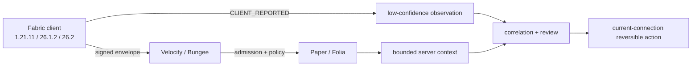

# MCAce

MCAce is a privacy-first trust, admission, evidence, and reversible-disposition
stack for modern Minecraft networks. The release surface is intentionally small:
Fabric client Mods, Velocity/BungeeCord proxy plugins, and one Paper/Folia
backend plugin.

> **v0.0.1 status: release gates still open.** The code and server matrix are
> active, but the tag is not claimed until the three visible GUI approvals, a
> real server-side detection/interception event, a genuine licensed Vulcan event,
> and a real Fabric federation handoff are recorded on the reviewed commit.

[中文 README](README_CN.md) · [release gates](docs/RELEASE_GATES.md) ·
[security model](docs/SECURITY.md) · [anti-cheat evidence](docs/evidence/anti-cheat-detection-2026-08-21.json)


## Scope and privacy contract

- Fabric client Mods: `1.21.11`, `26.1.2`, and `26.2`.
- Velocity and BungeeCord proxy plugins.
- Paper/Folia backend plugin.
- Default mode is `MONITOR`; client-origin facts are advisory and cannot punish
  a player alone.
- Screenshots/file evidence require an explicit, visible consent decision.
- `DENY` is connection-scoped, reviewable, and reversible; there is no automatic
  permanent BAN.
- No launcher, agent, kernel driver, hidden capture, keylogging,
  camera/microphone access, arbitrary packet exploit, or mandatory cloud service
  is in the release boundary.

## Compatibility allowlist

Compatibility is an exact tuple contract, not a protocol-number guess.


| Minecraft | Protocol | Java | Fabric Loader | Fabric API | Client artifact |
| --- | ---: | ---: | --- | --- | --- |
| `1.21.11` | `774` | `21` | `0.19.3` | `0.141.6+1.21.11` | final remapped JAR |
| `26.1.2` | `775` | `25` | `0.19.3` | `0.155.2+26.1.2` | final named JAR |
| `26.2` | `776` | `25` | `0.19.3` | `0.157.0+26.2` | final named JAR |

`1.21.11` is the only verified `1.21.x` tuple. Unlisted patches fail closed.
Run the contract against a current bundle:

```powershell
.\scripts\version-compatibility-contract-smoke.ps1 -Execute
.\scripts\version-compatibility-contract-smoke.ps1 -ReportOnly `
  -ReportPath .\build\compatibility-contract\report.json
```

## Evidence dashboard

| Gate | Current evidence | State |
| --- | --- | --- |
| Root + modern strict offline tests | Historical exact bundle: `171 suites / 755 tests / 0 failures / 0 errors`; latest Helio snapshot ran Fabric, Velocity, and runtime compatibility tests successfully | PASS within recorded source boundary |
| Paper/Folia × Velocity/Bungee process matrix | [`server-version-process-matrix-2026-08-22.json`](docs/evidence/server-version-process-matrix-2026-08-22.json): `12/12`, six exact version trees, cleanup zero; the sidecar binds the pre-README documentation tree | PASS for recorded snapshot; release rebind pending |
| Fabric GUI consent | 1.21.11 reached the visible explicit-file screen; no click was recorded, so no release evidence was minted | PENDING 6 human decisions |
| Anti-cheat detection | Fixture classification and replay/integrity tests pass; real client load was disconnected and did not produce a server detection event | Defensive regression only; real server event pending |
| Vulcan | Static contracts pass; licensed JAR and genuine external trigger are absent from this workspace | PENDING |
| Fabric federation | V2 static contract passes; source-export/target-import GUI handoff has not been executed | PENDING |
| Exact-commit CI/release | Canonical `main` run [`32562226250`](https://github.com/TypeThe0ry/MCAce/actions/runs/32562226250) passed on merge parent `22288f60d61d39d169a5b7f1552e21e8514fa9c9`; the [evidence record](docs/evidence/release-bundle-2026-08-22.json) captures the exact eight-file bundle, `release_identity=true`, and verified `SHA256SUMS` | PASS for that exact commit; a later docs-only commit requires a fresh canonical run |

The canonical release evidence is bound to the immutable merge-parent commit
shown above. Verify any checkout with `git rev-parse HEAD`; do not copy an
artifact to a tag unless its `release-manifest.properties` has
`release_identity=true` and the `source_commit` matches that checkout exactly.
The current v0.0.1 release decision is still controlled by the six human GUI
approvals plus the real anti-cheat, Vulcan, and federation gates below.


## Anti-cheat and feature detection

The pipeline separates origin and confidence:

1. `CLIENT_REPORTED` mod/resource-pack facts are low-confidence observations.
2. Signature, nonce, sequence, expiry, replay, and scope checks reject malformed
   or stale evidence.
3. Correlation can create a review signal only when configured providers and
   windows corroborate it.
4. High-impact actions require a `SERVER_CONFIRMED` producer or durable operator
   authorization. A client load is not a detection or enforcement result.

The controlled fixture command is metadata-only and does not execute third-party
code:

```powershell
.\scripts\anticheat-fixture-smoke.ps1 -Execute `
  -MinecraftVersion 1.21.11 `
  -MeteorJar 'C:\fixtures\meteor-client.jar' -MeteorSha256 '<sha256>' `
  -XrayPack 'C:\fixtures\Spectator_Xray_1.2.1.zip' -XraySha256 '<sha256>'
```

The retained real-client record proves client discovery/resource loading only.
It explicitly records `real_server_connection=false`,
`real_server_detection_event=false`, and
`real_server_enforcement_exercised=false`; therefore this repository currently
does not claim detection precision, kick/DENY efficacy, or BAN efficacy.

## Build and test

Root modules use JDK 21; the isolated modern clients use JDK 25. Keep the build
offline and dependency verification strict:

```powershell
$env:JAVA_HOME = '<JDK 21 home>'
.\gradlew.bat clean build localVerificationBundle `
  "-PmcaceSourceCommit=$(git rev-parse HEAD)" `
  "-PmcaceModernJavaHome=<JDK 25 home>" `
  --offline --dependency-verification=strict --rerun-tasks `
  --no-build-cache --no-configuration-cache --no-daemon `
  --no-parallel --max-workers=1 --console=plain
```

Server process verification:

```powershell
.\scripts\server-version-process-matrix.ps1 -Execute
.\scripts\server-version-process-matrix.ps1 -ReportOnly
```

To reduce controller load, meaningful compile/test jobs are dispatched to the
configured cluster. The latest verified remote job ran on **Helio** (Windows,
JDK 21, RTX 4070 host) with explicit Gradle JVM settings
`-Xmx2G -XX:TieredStopAtLevel=1`; it completed in about 1m20s with exit code 0.
The remote checkout was a sanitized tree-equivalent snapshot of the reviewed
commit. Credentials and worker paths are never copied into the repository.

## Manual GUI gates

Each target requires two visible decisions: explicit-file consent and a separate
`GAME_RENDER_FRAME` evidence consent. The runner waits for a human click and
records the screen stage, decision, artifact hash, cleanup, and binding. It does
not synthesize input:

```powershell
$env:JAVA_HOME = '<JDK 21 or JDK 25 home for the target>'
.\scripts\platform-load-smoke.ps1 -FabricTarget 1.21.11 -WithFabricEvidence
.\scripts\platform-load-smoke.ps1 -FabricTarget 26.1.2 -WithFabricEvidence
.\scripts\platform-load-smoke.ps1 -FabricTarget 26.2 -WithFabricEvidence
```

Use `-ReportOnly` with the emitted report/binding hashes after each successful
run. A timeout report is diagnostic-only and cannot be promoted to release
evidence.

## Vulcan and federation gates

Vulcan requires an operator-supplied licensed JAR, current-source structural
preflight, isolated Paper enablement, and one externally triggered genuine event.
MCAce never downloads or redistributes that artifact. The genuine-event wrapper
rejects synthetic event injection and records only sanitized evidence.

Federation requires source export consent, source disconnect, direct target
connection, target import consent, subject binding, expiry observation, and
zero residual owned processes/ports. Static tests are not a handoff result.

## Release artifacts

The exact distribution is eight entries: six deployable JARs,
`release-manifest.properties`, and `SHA256SUMS`. Hashes must come from the clean
exact-commit `releaseBundle`; do not paste hashes from an older build into a
release note.
The recorded bundle still carries Gradle `product_version=0.1.0-SNAPSHOT`; the
`v0.0.1` label is not promoted to a tag while the external release gates remain
open.

| Entry | Role |
| --- | --- |
| `mcace-client-fabric-1.21.11.jar` | Fabric 1.21.11 client |
| `mcace-client-fabric-26.1.2.jar` | Fabric 26.1.2 client |
| `mcace-client-fabric-26.2.jar` | Fabric 26.2 client |
| `mcace-server-velocity.jar` | Velocity proxy plugin |
| `mcace-server-bungeecord.jar` | BungeeCord proxy plugin |
| `mcace-server-paper.jar` | Paper/Folia backend plugin |
| `release-manifest.properties` | exact source/runtime identity |
| `SHA256SUMS` | authoritative JAR hashes |

## Architecture



## Repository map

| Module | Responsibility |
| --- | --- |
| `mcace-protocol` | wire contract, signing, replay defense |
| `mcace-core` | sessions, policy, risk, disposition, federation |
| `mcace-client-common` | loader-neutral integrity/evidence primitives |
| `mcace-client-fabric` | 1.21.11 client and consent UI |
| `fabric-modern` | JDK25 official-namespace clients |
| `mcace-server-velocity` / `mcace-server-bungeecord` | proxy adapters |
| `mcace-server-paper` | Paper/Folia adapter |
| `scripts/` | fail-closed build, asset, compatibility, and evidence gates |

More detail: [architecture](docs/ARCHITECTURE.md), [operations](docs/OPERATIONS.md),
[platform testing](docs/PLATFORM_TESTING.md), [release gates](docs/RELEASE_GATES.md),
[security](docs/SECURITY.md), and [federation](docs/FEDERATION.md).
