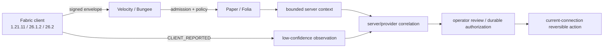

# MCAce

MCAce is a defensive trust, admission, evidence, and reversible-disposition
platform for modern Minecraft networks. It combines signed client attestations,
scoped integrity evidence, replay-resistant sessions, server-side context, and
explainable actions.

> **Release-candidate boundary:** this repository is ready for a reviewed release
> candidate, not a claim of universal `1.21.x` compatibility or a finished
> production behavior anti-cheat. Client artifacts are advisory until an
> independently verified server signal and operator policy authorize an action.

[中文 README](README_CN.md) · [security model](docs/SECURITY.md) · [current evidence](docs/evidence/anti-cheat-detection-2026-08-21.json)


## What is verified now

| Area | Current result | Meaning |
| --- | --- | --- |
| Root + modern builds | `171 suites / 755 tests / 0 failures / 0 errors` | JDK 21 root plus isolated JDK 25 modern clients |
| Exact release bundle | `8/8` entries | Six deployable JARs plus manifest and `SHA256SUMS` |
| Server process matrix | `12/12` | Paper/Folia × Velocity/Bungee across the three exact targets; Folia 26.2 is beta |
| Compatibility contract | `3/3` | Exact protocol, Java, metadata, nested-JAR, and fail-closed version checks |
| Anti-cheat regression | `31` checks | Feature classification, integrity, replay, correlation, and bounded real-client load |

The current pushed branch is [`codex/release-2026-08-21`](https://github.com/TypeThe0ry/MCAce/tree/codex/release-2026-08-21);
the exact source commit is recorded in `release-manifest.properties`.
The detailed handoff is [Next iteration status](docs/NEXT_ITERATION_2026-08-21.md).

## Exact Minecraft compatibility

Compatibility is an allowlist, not a protocol threshold. The current raw-peer
and artifact contract accepts exactly these tuples:


| Minecraft | Protocol | Java | Fabric Loader | Fabric API | Artifact |
| --- | ---: | ---: | --- | --- | --- |
| `1.21.11` | `774` | `21` | `0.19.3` | `0.141.6+1.21.11` | final remapped JAR |
| `26.1.2` | `775` | `25` | `0.19.3` | `0.155.2+26.1.2` | final named JAR |
| `26.2` | `776` | `25` | `0.19.3` | `0.157.0+26.2` | final named JAR |

`1.21.11` is the only verified `1.21.x` target. `1.21.1`, `1.21.10`,
`26.1`, `26.3`, and other unlisted patches fail closed; they must not be
described as supported without a new wire profile, assets, build, and process
evidence.

Run the compatibility contract against the exact bundle:

```powershell
.\scripts\version-compatibility-contract-smoke.ps1 -Execute
.\scripts\version-compatibility-contract-smoke.ps1 -ReportOnly `
  -ReportPath .\build\compatibility-contract\report.json
```

The contract checks `protocol`, Java major, Fabric metadata, commit-bound client
build IDs, artifact mode, nested JAR shape, exact eight bundle entries, and
unsupported-version rejection. Durable evidence is in
[`version-compatibility-contract-2026-08-21.json`](docs/evidence/version-compatibility-contract-2026-08-21.json).

## Build and verify

Use Temurin `21.0.7+6` for the root build and `25.0.3+9` for `fabric-modern`:

```powershell
$env:JAVA_HOME = '<Temurin 21.0.7+6 home>'
.\gradlew.bat clean build releaseBundle `
  "-PmcaceSourceCommit=$(git rev-parse HEAD)" `
  "-PmcaceModernJavaHome=<Temurin 25.0.3+9 home>" `
  --offline --dependency-verification=strict --rerun-tasks `
  --no-build-cache --no-configuration-cache --no-daemon `
  --no-parallel --max-workers=1 --console=plain
```

Authoritative process verification:

```powershell
.\scripts\server-version-process-matrix.ps1 -Execute
.\scripts\server-version-process-matrix.ps1 -ReportOnly
```

The matrix covers Paper/Folia on `1.21.11`, `26.1.2`, and `26.2`, through both
Velocity and BungeeCord. It binds server JARs, prepared runtime trees, Java
runtime hashes, protocol profiles, raw reports, cleanup, and current source.

## Anti-cheat and feature detection


The defensive pipeline distinguishes evidence origin:

1. `CLIENT_REPORTED` artifact or behavior facts are low-confidence observations.
2. Integrity, nonce, sequence, expiry, replay, and scope checks reject malformed
   or stale evidence.
3. Behavior correlation can raise a review signal only when configured providers
   and windows corroborate it.
4. High-impact actions require a server-confirmed signal or durable
   administrator authorization. DENY closes only the current connection; there
   is no automatic permanent BAN.

The controlled fixture gate validates a Meteor JAR and an Xray resource pack
without executing third-party code:

```powershell
.\scripts\anticheat-fixture-smoke.ps1 -Execute `
  -MeteorJar <absolute path> -MeteorSha256 <sha256> `
  -XrayResourcePack <absolute path> -XraySha256 <sha256> `
  -TargetVersion 1.21.11
```

A separate bounded real-client smoke proved that the supplied Meteor JAR was
discovered and initialized and that `Spectator_Xray_1.2.1.zip` was reloaded by a
1.21.11 Fabric client. It intentionally did **not** connect to a server or
activate a cheat feature, so it is a client-load result—not a detection-rate,
kick, deny, or ban result. The client was not network-isolated and attempted
normal account/Realms requests. See the full
[anti-cheat evidence record](docs/evidence/anti-cheat-detection-2026-08-21.json)
and [detection boundary](docs/DETECTION_AND_EVIDENCE.md).


## Release artifacts

The local exact bundle is under `build/release-bundle/` and contains six JARs,
`release-manifest.properties`, and `SHA256SUMS`. The manifest and sums file are
the only authoritative hash source; do not copy a previous commit's JAR hashes
into documentation.

| Entry | Role |
| --- | --- |
| `mcace-client-fabric-1.21.11.jar` | Fabric 1.21.11 remapped client |
| `mcace-client-fabric-26.1.2.jar` | Fabric 26.1.2 named client |
| `mcace-client-fabric-26.2.jar` | Fabric 26.2 named client |
| `mcace-server-velocity.jar` | Velocity proxy plugin |
| `mcace-server-bungeecord.jar` | BungeeCord proxy plugin |
| `mcace-server-paper.jar` | Paper/Folia backend plugin |
| `release-manifest.properties` | source commit, runtime, identity, and artifact metadata |
| `SHA256SUMS` | six deployable JAR hashes |

Verify the current bytes directly:

```powershell
Get-Content .\build\release-bundle\SHA256SUMS
Get-FileHash .\build\release-bundle\*.jar -Algorithm SHA256
```

## Current progress and next iteration

Done: exact three-target packaging, protocol profiles, server process matrix,
strict offline dual-JDK build, anti-cheat classification, real client-load smoke,
and source-bound release evidence.

Next, in order:

1. Run the six visible Fabric GUI consent gates (two per exact target).
2. Run a real local server connection with an approved test account and record
   server-side detection/deny behavior; do not infer it from client loading.
3. Revalidate current-source Vulcan delivery and wire a genuine
   `SERVER_CONFIRMED` producer only after provider/profile/key/topology review.
4. Complete the real Fabric federation export → disconnect → target import flow.
5. Run protected-branch exact-commit CI and publish a signed/tagged release.

## Architecture



## Repository map

| Module | Responsibility |
| --- | --- |
| `mcace-protocol` | canonical wire contract, signing, replay defense |
| `mcace-core` | sessions, policy, risk, disposition, federation foundations |
| `mcace-client-common` | loader-neutral integrity and evidence primitives |
| `mcace-client-fabric` | Fabric 1.21.11 remapped client |
| `fabric-modern/client-26.1.2` | JDK25 official-namespace client |
| `fabric-modern/client-26.2` | JDK25 official-namespace client |
| `mcace-server-velocity` / `mcace-server-bungeecord` | proxy adapters |
| `mcace-server-paper` | Paper/Folia backend adapter |
| `scripts/` | fail-closed build, asset, compatibility, and process gates |

More detail: [architecture](docs/ARCHITECTURE.md), [operations](docs/OPERATIONS.md),
[platform testing](docs/PLATFORM_TESTING.md), [release gates](docs/RELEASE_GATES.md),
[migration](docs/MIGRATION.md), [security](docs/SECURITY.md), and
[federation](docs/FEDERATION.md).

## Security boundary

MCAce does not do full-disk scanning, keylogging, camera/microphone access,
browser inspection, hidden execution, kernel drivers, packet exploits, or
bypass development. Unknown artifacts are not automatic cheat verdicts. Keep
high-impact decisions server-confirmed, explainable, reversible, and reviewable.
