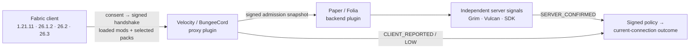
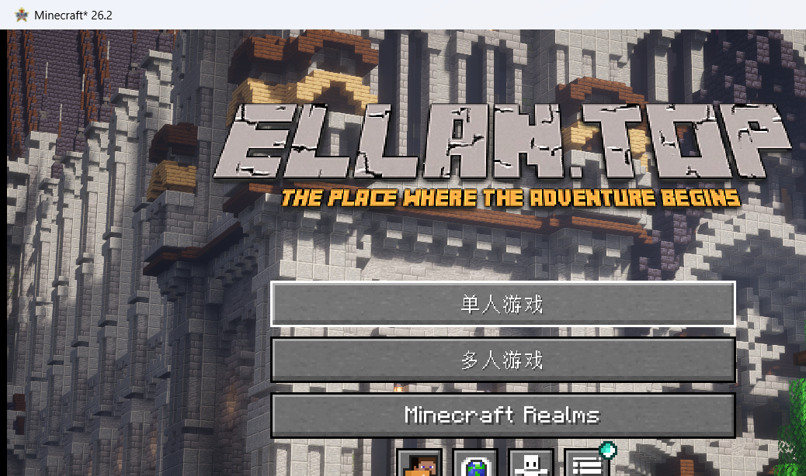
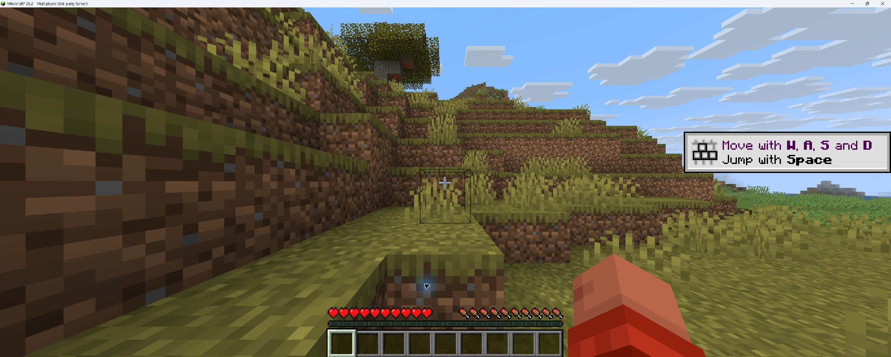
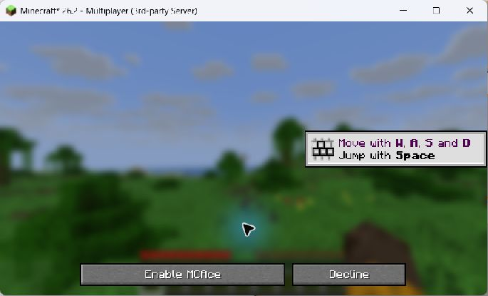

<div align="center">

# MCAce

**A consent-first anti-cheat layer for Fabric + Velocity/BungeeCord + Paper/Folia networks.**

The client tells the server what it actually loaded. The server checks that
against its own evidence. A signed policy decides what happens — and every
step is bounded, reviewable, and reversible.

[](https://github.com/TypeThe0ry/MCAce/actions/workflows/build.yml)
[](https://github.com/TypeThe0ry/MCAce/releases/latest)
[](LICENSE)


[中文说明](README_CN.md) · [Operator guide](docs/OPERATIONS.md) · [Architecture](docs/ARCHITECTURE.md) · [Security model](docs/SECURITY.md) · [Release gates](docs/RELEASE_GATES.md)

</div>

---

## Why this exists

Most Minecraft anti-cheat lives entirely on the server and guesses at what the
client is doing from movement packets. Client-side "anti-cheat" mods, on the
other hand, tend to be opaque: players don't know what is being read, and
server owners can't verify the answer wasn't forged.

MCAce sits in between. A small Fabric mod asks the player for permission
*once per connection*, then reports a narrow, signed snapshot of the client:
which mods are actually loaded, which resource/shader packs are selected, and
a few bounded texture observations. Proxy and backend plugins verify that
snapshot, correlate it with server-side signals (Grim, Vulcan, or your own),
and apply a policy that an administrator has signed.

What it deliberately is **not**: a kernel driver, a persistent agent, a
memory scanner, a screenshot-on-demand spy, or an auto-ban machine. The
released authority ceiling is `MONITOR` — MCAce records; humans decide.

## How it works


```mermaid
flowchart LR
  C[Fabric client<br/>1.21.11 · 26.1.2 · 26.2 · 26.3]
  P[Velocity / BungeeCord<br/>proxy plugin]
  B[Paper / Folia<br/>backend plugin]
  S[Independent server signals<br/>Grim · Vulcan · SDK]
  R[Signed policy →<br/>current-connection outcome]

  C -->|"consent → signed handshake<br/>loaded mods + selected packs"| P
  P -->|"signed admission snapshot"| B
  B --> S
  S -->|"SERVER_CONFIRMED"| R
  P -->|"CLIENT_REPORTED / LOW"| R
```

1. **Read.** After the player clicks *Enable MCAce*, the client reads Fabric
   Loader's real runtime graph (`FabricLoader.getAllMods()`), the selected
   resource/shader packs, and a bounded texture probe. No absolute paths, no
   file contents, at most 2048 canonically ordered mod IDs.
2. **Correlate.** The proxy verifies signature, nonce, sequence, expiry and
   replay, then joins the report with evidence the server produced on its
   own for the *same session*. A client claim alone is always
   `CLIENT_REPORTED / LOW`; it can never promote itself.
3. **Act.** An administrator-signed policy picks the outcome. Client-origin
   facts can drive `OBSERVE`, `NOTICE`, `WARN` or `CHALLENGE`. Anything
   heavier needs independent server confirmation, is scoped to the current
   connection, and is reversible. There is no automatic permanent ban.

Read the [detection contract](docs/DETECTION_AND_EVIDENCE.md) and the
[threat model](docs/THREAT_MODEL_AND_BYPASS.md) for the precise boundaries.

## What players see

The mod starts **disabled** and stays that way until the player explicitly
enables it for this connection. Declining, closing the screen, timing out, or
disconnecting all leave MCAce off. Consent is never persisted across
reconnects.

| Client menu | Enabled session | Consent screen |
| :---: | :---: | :---: |
|  |  |  |

*Real Minecraft windows captured during repository smokes, not mockups. The
screenshots are visual provenance only; the signed JSON, logs and hashes are
the actual evidence.*

## Supported versions

MCAce pins an **exact** Minecraft patch, protocol and Fabric API per client
artifact. An unlisted patch fails closed rather than "probably working".

| Minecraft | Protocol | Java | Fabric Loader | Fabric API | Server lane |
| :-- | --: | --: | :-- | :-- | :-- |
| `1.21.11` | 774 | ≥ 21 | ≥ 0.19.3 | `0.141.6+1.21.11` | Paper + Folia · stable |
| `26.1.2`  | 775 | ≥ 25 | ≥ 0.19.3 | `0.155.2+26.1.2`  | Paper + Folia · stable |
| `26.2`    | 776 | ≥ 25 | ≥ 0.19.3 | `0.157.0+26.2`    | Paper stable · Folia beta |
| `26.3`    | 777 | ≥ 25 | ≥ 0.19.3 | `0.161.0+26.3`    | Paper beta (experimental lane, no Folia build yet) |

Proxies: Velocity 3.5.x / 4.2.x and BungeeCord. Backends: Paper and Folia.
See [Fabric compatibility](docs/FABRIC_COMPATIBILITY.md).

## Quick start

### Server owners

1. Drop `mcace-server-velocity.jar` **or** `mcace-server-bungeecord.jar` into
   your proxy's `plugins/` and start it once. MCAce generates an Ed25519
   identity and writes the public half to
   `plugins/mcace/identity/server-public-key.txt`
   (`plugins/MCAce/` on Bungee). Never share `server-private-key.pk8`.
2. Drop `mcace-server-paper.jar` into every Paper/Folia backend's `plugins/`
   and copy the proxy's *public* key to `plugins/MCAce/proxy-public-key.txt`.
   The backend refuses to enable without a valid pin.
3. Leave `enforcement.mode=MONITOR` in `mcace.properties` until you have read
   the [operator guide](docs/OPERATIONS.md). `LIMITED_ROUTE` needs two
   distinct, already-registered fallback servers.
4. Hand the public key to your players (Discord, wiki, launcher profile —
   anywhere out-of-band).

Useful admin commands (`mcace.admin.audit`):

```text
/mcaceobservation inventory <uuid>          # loaded-mod / pack counts + receipt age
/mcaceobservation freshness <uuid> [secs]   # FRESH | STALE | CLOCK_ANOMALY | UNAVAILABLE
```

### Players

1. Install the client JAR that matches your Minecraft version, plus the exact
   Fabric API listed above, into `mods/`.
2. Create `.minecraft/config/mcace/server-keys.properties`:

   ```properties
   play.example.net=BASE64_PUBLIC_KEY_FROM_THE_SERVER
   ```

   The address must match the server-list entry exactly. A missing or wrong
   pin means MCAce simply stays off — it never answers an unpinned server.
3. Join. Click **Enable MCAce** if you agree to what the screen describes.
   That's the whole flow.

## Release status

**Current release: [v0.0.1](https://github.com/TypeThe0ry/MCAce/releases/tag/v0.0.1)**
— six JARs for `1.21.11` / `26.1.2` / `26.2`, built by protected CI from
`1007e55`, checksums attached. The `26.3` client and the 14-case server
matrix landed on `main` afterwards and ship in the next tag.

MCAce separates the *core contract* (it builds, it runs, it verifies) from an
*extended certification track* that needs evidence signed by keys held outside
this repository. Nothing on the extended track is closed by a fixture, a
historical pass, or a caller Boolean; each gate fails closed until real
evidence exists.

| Gate | What it proves | State |
| :-- | :-- | :-- |
| Protected exact-release bundle | Protected CI rebuilt the exact bundle and every hash matches | ✅ passed |
| Server version matrix (V4) | 14 real Paper/Folia × Velocity/Bungee process cases, externally supervised | ✅ passed for `28e4bb6` |
| GUI consent witness | One human, visible *Enable MCAce* click, GUI-signed and PNG-bound | ⏳ pending |
| Federation V5 handoff | Proxy-to-proxy handoff inherits that consent with no second prompt | ⏳ pending |
| Vulcan V3 genuine event | Licensed Vulcan fires a real (non-synthetic) provider event | ⏳ pending |
| Production Authority V4 | Signed backend→proxy authority chain captured end to end | ⏳ pending |

The full ledger — every dated run, hash and caveat that used to live in this
README — is archived in
[`docs/evidence/README_STATUS_LEDGER_2026-09.md`](docs/evidence/README_STATUS_LEDGER_2026-09.md).
Gate definitions are in [release gates](docs/RELEASE_GATES.md).

## Building

Root modules use JDK 21; the `26.x` clients build in isolated JDK 25 projects.
Dependency verification is strict and the build is expected to work offline.

```powershell
$env:JAVA_HOME = '<JDK 21 home>'
.\gradlew.bat clean build localVerificationBundle `
  "-PmcaceProductVersion=0.0.1" `
  "-PmcaceSourceCommit=$(git rev-parse HEAD)" `
  "-PmcaceModernJavaHome=<JDK 25 home>" `
  --offline --dependency-verification=strict
```

Try the whole thing locally — proxy, backend, and a real Fabric client with
the consent screen — on one target:

```powershell
.\scripts\platform-load-smoke.ps1 -FabricTarget 26.2 -WithFabricEvidence
```

More in [platform testing](docs/PLATFORM_TESTING.md) and
[runtime testing](docs/RUNTIME_TESTING.md).

## Repository map

| Module | What lives there |
| :-- | :-- |
| `mcace-protocol` | Wire schemas, signing, canonical encoding, replay defense |
| `mcace-core` | Sessions, admission, policy, risk, disposition, federation |
| `mcace-client-common` | Loader-neutral integrity scan, Loaded ModList model, consent primitives |
| `mcace-client-fabric` | Fabric 1.21.11 client (JDK 21) |
| `fabric-modern` | Fabric 26.1.2 / 26.2 / 26.3 clients (JDK 25) |
| `mcace-server-velocity` · `mcace-server-bungeecord` | Proxy plugins |
| `mcace-server-paper` | Paper/Folia backend plugin and provider adapters |
| `mcace-runtime-integration` | Real-process harnesses and end-to-end tests |
| `scripts/` | Fail-closed build, smoke, matrix, evidence and readiness tooling |
| `docs/` | Design docs and the evidence archive |

## Documentation

- [Operator guide](docs/OPERATIONS.md) — install, pins, policies, commands
- [Architecture](docs/ARCHITECTURE.md) · [Product scope](docs/PRODUCT_SCOPE.md)
- [Detection and evidence](docs/DETECTION_AND_EVIDENCE.md) · [Detection catalog](docs/DETECTION_CATALOG.md)
- [Client integrity policy](docs/CLIENT_INTEGRITY_POLICY.md) · [Inventory admission](docs/INVENTORY_ADMISSION.md)
- [Threat model and bypass boundary](docs/THREAT_MODEL_AND_BYPASS.md) ([中文](docs/THREAT_MODEL_AND_BYPASS_CN.md))
- [Security model](docs/SECURITY.md) · [Server-confirmed authority](docs/SERVER_CONFIRMED_AUTHORITY.md)
- [Federation](docs/FEDERATION.md) · [Behavior integrations](docs/BEHAVIOR_INTEGRATIONS.md)
- [Release gates](docs/RELEASE_GATES.md) · [Server version matrix evidence V4](docs/SERVER_VERSION_MATRIX_EVIDENCE_V4.md)

## License

[MIT](LICENSE) © 2026 Ellan
