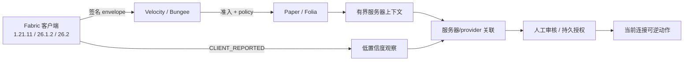

# MCAce（中文说明）

MCAce 是面向现代 Minecraft 网络的防御性信任、准入、证据与可逆处置平台。
它提供签名客户端证明、范围化完整性清单、抗重放会话、服务器上下文和可解释
处置动作。

> **发布候选边界：** 当前可以作为经过审查的 Release Candidate 发布，但不能
> 宣称覆盖所有 `1.21.x`，也不能把客户端特征当成完成的行为反作弊。客户端事实
> 默认只是低置信度观察；高影响动作必须有独立服务器信号或持久化管理员授权。

[English README](README.md) · [安全模型](docs/SECURITY.md) · [反作弊证据](docs/evidence/anti-cheat-detection-2026-08-21.json)


## 当前进度

| 项目 | 当前结果 | 含义 |
| --- | --- | --- |
| 根构建 + modern 构建 | `171 suites / 755 tests / 0 failures / 0 errors` | JDK21 根模块 + JDK25 modern 客户端 |
| exact 发布包 | `8/8` | 六个可部署 JAR + manifest + `SHA256SUMS` |
| 服务端真实进程矩阵 | `12/12` | Paper/Folia × Velocity/Bungee；Folia 26.2 为 beta |
| 版本兼容合同 | `3/3` | 协议、Java、metadata、nested JAR、拒绝未知版本 |
| 反作弊回归 | `31` 项 | 特征分类、完整性、重放、行为关联、真实客户端加载 |

当前提交为 `6acd6f8d578de82497c5c2e9ecb803c2f4458cb1`，分支为
[`codex/release-2026-08-21`](https://github.com/TypeThe0ry/MCAce/tree/codex/release-2026-08-21)。
详细交接记录见 [下一轮迭代状态](docs/NEXT_ITERATION_2026-08-21.md)。

## 精确版本适配

兼容性采用精确 allowlist，不根据协议号大小推导：


| Minecraft | 协议号 | Java | Fabric Loader | Fabric API | 产物 |
| --- | ---: | ---: | --- | --- | --- |
| `1.21.11` | `774` | `21` | `0.19.3` | `0.141.6+1.21.11` | Loom remap 最终 JAR |
| `26.1.2` | `775` | `25` | `0.19.3` | `0.155.2+26.1.2` | official named 最终 JAR |
| `26.2` | `776` | `25` | `0.19.3` | `0.157.0+26.2` | official named 最终 JAR |

当前真正验证的 `1.21.x` 只有 `1.21.11`。`1.21.1`、`1.21.10`、`26.1`、
`26.3` 和其他未列出的 patch 会 fail-closed；新增版本必须重新核对 wire
profile、资产、构建、加载和真实进程证据。

运行版本合同检查：

```powershell
.\scripts\version-compatibility-contract-smoke.ps1 -Execute
.\scripts\version-compatibility-contract-smoke.ps1 -ReportOnly `
  -ReportPath .\build\compatibility-contract\report.json
```

它检查协议号、Java 主版本、Fabric metadata、commit-bound build ID、产物模式、
nested JAR 结构、exact-8 包以及未知版本拒绝。耐久证据见
[`version-compatibility-contract-2026-08-21.json`](docs/evidence/version-compatibility-contract-2026-08-21.json)。

## 构建与验证

根工程使用 Temurin `21.0.7+6`，`fabric-modern` 使用 `25.0.3+9`：

```powershell
$env:JAVA_HOME = '<Temurin 21.0.7+6 路径>'
.\gradlew.bat clean build releaseBundle `
  "-PmcaceSourceCommit=$(git rev-parse HEAD)" `
  "-PmcaceModernJavaHome=<Temurin 25.0.3+9 路径>" `
  --offline --dependency-verification=strict --rerun-tasks `
  --no-build-cache --no-configuration-cache --no-daemon `
  --no-parallel --max-workers=1 --console=plain
```

权威服务端进程矩阵：

```powershell
.\scripts\server-version-process-matrix.ps1 -Execute
.\scripts\server-version-process-matrix.ps1 -ReportOnly
```

该矩阵覆盖三个精确版本、Paper/Folia、Velocity/Bungee，并绑定服务端 JAR、
prepared runtime、Java 哈希、协议 profile、raw report、清理结果和当前源码。

## 反作弊和特征检测


检测链路严格区分证据来源：

1. `CLIENT_REPORTED` 的 mod/resourcepack/行为事实只能作为低置信度观察。
2. 完整性、nonce、sequence、expiry、重放和 scope 检查负责拒绝伪造或过期证据。
3. 行为关联只有在配置的 provider 和时间窗口共同满足时才产生 review 信号。
4. 高影响动作需要服务器确认或管理员持久授权；DENY 只关闭当前连接，没有自动永久 BAN。

受控 fixture 会检查 Meteor JAR 和 Xray 资源包的 metadata，但不会执行第三方代码：

```powershell
.\scripts\anticheat-fixture-smoke.ps1 -Execute `
  -MeteorJar <绝对路径> -MeteorSha256 <sha256> `
  -XrayResourcePack <绝对路径> -XraySha256 <sha256> `
  -TargetVersion 1.21.11
```

另外完成了一次有界真实客户端 smoke：1.21.11 Fabric 客户端实际发现并初始化
Meteor，并重载 `Spectator_Xray_1.2.1.zip`。该运行没有连接服务器，也没有启用
作弊模块，所以它证明的是客户端加载，不是服务器检测率、踢出、DENY 或封禁效果；
客户端未做网络隔离，并尝试了正常账号/Realms 请求。完整边界见
[`anti-cheat-detection-2026-08-21.json`](docs/evidence/anti-cheat-detection-2026-08-21.json)
和 [`DETECTION_AND_EVIDENCE.md`](docs/DETECTION_AND_EVIDENCE.md)。


## 发布产物

本地 exact 包位于 `build/release-bundle/`，包含六个 JAR、manifest 和
`SHA256SUMS`。manifest 与 sums 文件是唯一权威 hash 来源，不要把上一提交的
JAR hash 复制到文档中。

| 文件 | 作用 |
| --- | --- |
| `mcace-client-fabric-1.21.11.jar` | Fabric 1.21.11 remap 客户端 |
| `mcace-client-fabric-26.1.2.jar` | Fabric 26.1.2 named 客户端 |
| `mcace-client-fabric-26.2.jar` | Fabric 26.2 named 客户端 |
| `mcace-server-velocity.jar` | Velocity 代理插件 |
| `mcace-server-bungeecord.jar` | BungeeCord 代理插件 |
| `mcace-server-paper.jar` | Paper/Folia 后端插件 |
| `release-manifest.properties` | source commit、运行时、身份和产物 metadata |
| `SHA256SUMS` | 六个可部署 JAR 的 hash |

直接校验当前字节：

```powershell
Get-Content .\build\release-bundle\SHA256SUMS
Get-FileHash .\build\release-bundle\*.jar -Algorithm SHA256
```

## 下一步迭代

已完成：三版本产物、协议 profile、12-case 服务端矩阵、双 JDK 严格离线构建、
反作弊特征分类、Meteor/Xray 真实客户端加载和源码绑定证据。

下一步按优先级：

1. 完成三个目标各两次可见 GUI consent，共六次人工确认。
2. 用批准的测试账号连接真实本地服务器，记录服务器检测、处置和误报边界。
3. 完成当前 Vulcan 源码/enablement/genuine event 验证，并审查
   `SERVER_CONFIRMED` provider/profile/key/topology。
4. 完成真实 Fabric federation：source export → 断开 → target import → 跨 TTL 在线。
5. 通过受保护分支 exact-commit CI 后再打正式 tag/release。

## 架构图



## 目录说明

| 模块 | 职责 |
| --- | --- |
| `mcace-protocol` | wire contract、签名、重放防护 |
| `mcace-core` | session、policy、risk、disposition、federation 基础 |
| `mcace-client-common` | loader-neutral 完整性和证据原语 |
| `mcace-client-fabric` | 1.21.11 remap 客户端 |
| `fabric-modern/client-26.1.2` | JDK25 official-namespace 客户端 |
| `fabric-modern/client-26.2` | JDK25 official-namespace 客户端 |
| `mcace-server-velocity` / `mcace-server-bungeecord` | 代理适配器 |
| `mcace-server-paper` | Paper/Folia 后端适配器 |
| `scripts/` | 构建、资产、兼容性和进程 gate |

更多资料：[架构](docs/ARCHITECTURE.md)、[运行](docs/OPERATIONS.md)、
[平台测试](docs/PLATFORM_TESTING.md)、[发布门](docs/RELEASE_GATES.md)、
[迁移](docs/MIGRATION.md)、[安全](docs/SECURITY.md)、[federation](docs/FEDERATION.md)。

## 安全边界

MCAce 不做全盘扫描、键盘记录、摄像头/麦克风访问、浏览器检查、隐藏执行、
内核驱动、封包利用或绕过开发。未知 artifact 不是自动作弊结论；高影响动作必须
服务器确认、可解释、可逆并可审计。
