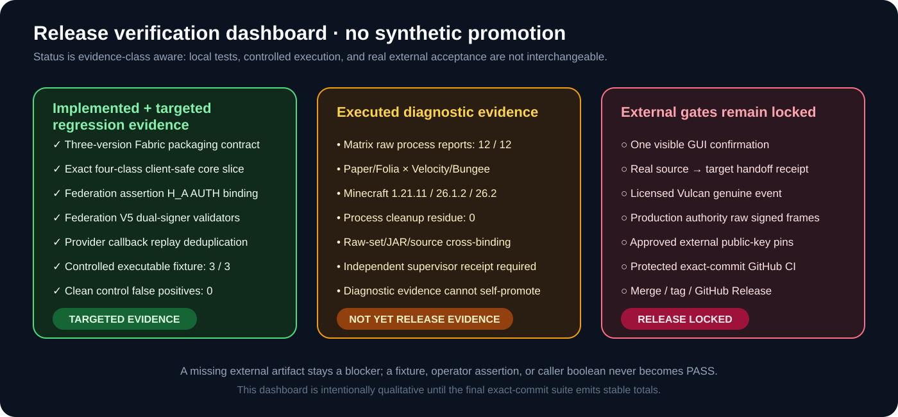
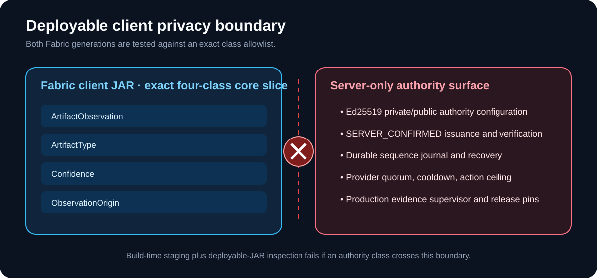
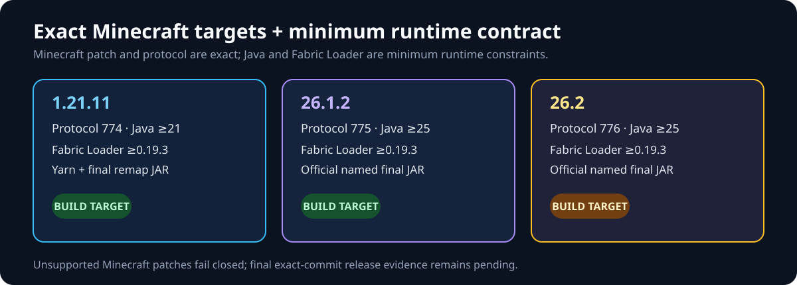
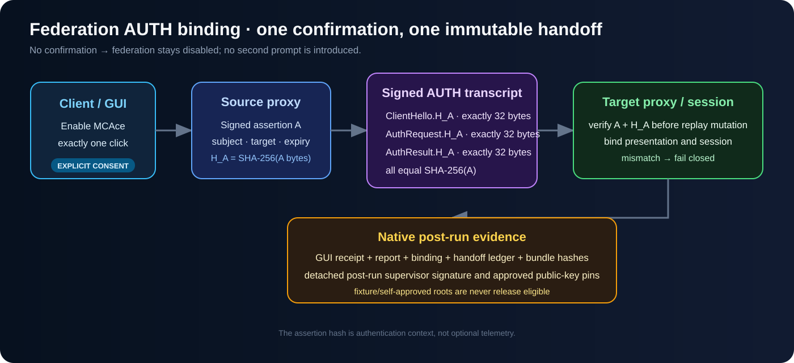
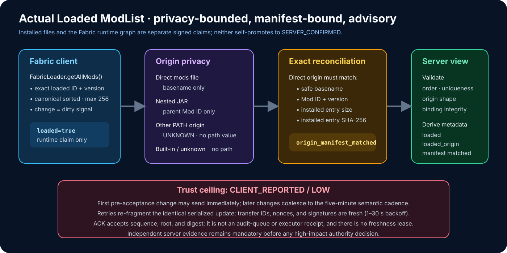
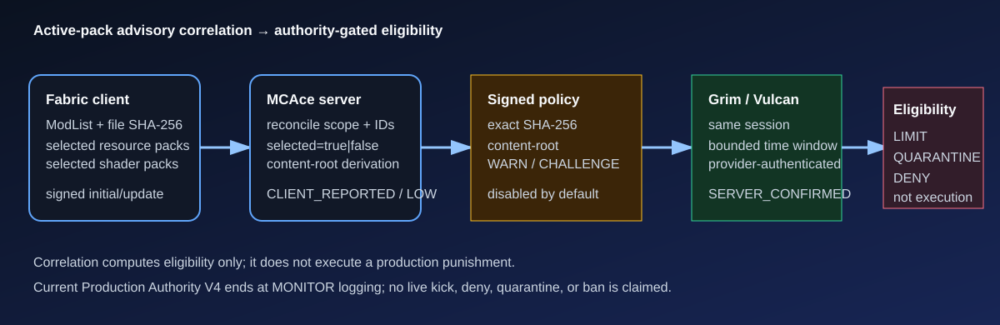
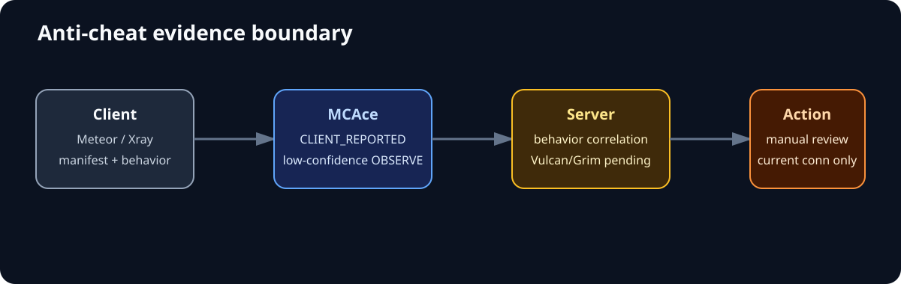
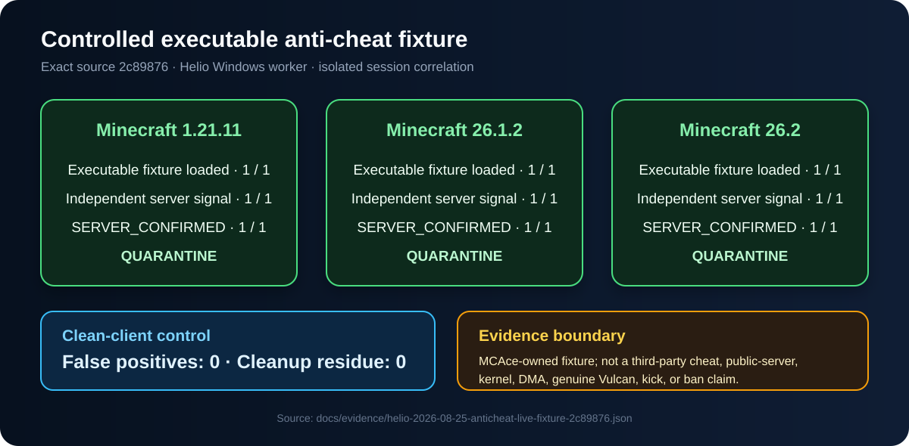
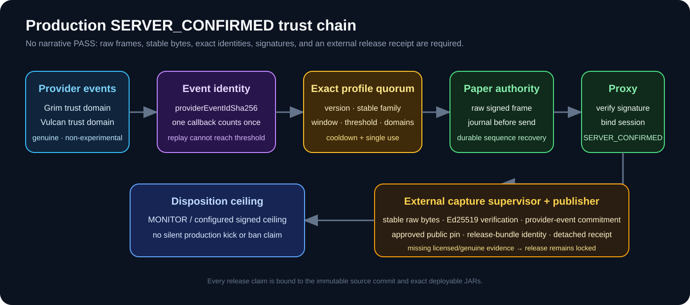
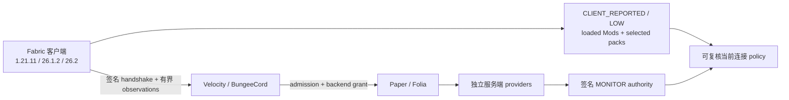

# MCAce（中文说明）

MCAce 是面向现代 Minecraft 网络的隐私优先客户端可见性、准入、证据与可逆处置栈。
它的可部署边界严格收窄为 Fabric 客户端 Mod、Velocity/BungeeCord 代理插件，以及一个
Paper/Folia 后端插件。

> ## v0.0.1 — RELEASE LOCKED
>
> **当前没有创建正式 tag，也没有发布 GitHub Release。** 只有下面七个 fail-closed
> 发布门在同一个已审查精确源码上全部通过后才能放行。当前仍缺 Matrix V4 外部 supervisor
> 签名包、一次可见且绑定当前连接的 `Enable MCAce` 决定及真实 Federation V5 handoff、
> 外部 supervisor 签名的 licensed Vulcan V3 genuine event、Production Authority V4
> 外部 MONITOR 捕获包，以及受保护 main/tag 的 V4 exact-commit CI。拒绝、关闭、超时或
> 未确认时，MCAce 保持禁用。

[English README](README.md) · [架构](docs/ARCHITECTURE.md) ·
[安全模型](docs/SECURITY.md) · [发布门](docs/RELEASE_GATES.md) ·
[运维](docs/OPERATIONS.md)



## 发布状态：精确七门

以下名称和 `scripts/release-readiness.ps1` 完全一致。受控 fixture、历史 PASS、调用者
Boolean 或未签名报告都不能把任何发布门提升为通过。

| Readiness gate | 正式发布需要的证据 | 状态 |
| --- | --- | --- |
| `server_matrix_exact_source` | Matrix V4 七根条目 native package；精确 12 份 raw 进程 case；进程 incarnation 与清理承诺；受保护 V4 release bundle 和三份服务端 JAR 交叉绑定；仓库外 RSA supervisor root、受保护 pin、新鲜 detached receipt、replay 与 TOCTOU 校验 | **PENDING** |
| `fabric_gui_single_enablement_confirmation` | 整个 v0.0.1 发布验收只保留一次真人来源、可见、绑定当前连接的 `Enable MCAce` 决定；签名 GUI attestation 和完整解码 PNG 必须进入 Federation V5 证据集 | **PENDING** |
| `fabric_federation_real_handoff` | Federation V5 source→target handoff、继承同一次确认且不弹第二次窗口、subject/route/session 绑定、expiry 与关联负例、runtime ledger、零自有残留，以及不同 post-run supervisor 的 receipt | **PENDING** |
| `vulcan_genuine_event` | 已审查 licensed Vulcan JAR、真实非合成外部 provider event、精确发布产物绑定，以及仓库外已批准 supervisor 签名的 Vulcan V3 receipt/index | **PENDING** |
| `production_server_confirmed_authority` | Authority V4 raw package，包含真实 Grim/Vulcan provider events、实际签名 grant/observation frames、进程与 journal ledgers、精确 V4 服务端 JAR、已批准外部 Ed25519 supervisor receipt 和 native release index | **PENDING** |
| `protected_exact_release_bundle` | 受保护 `main` 或 `v0.0.1` tag-push CI 校验精确 `MCACE_RELEASE_BUNDLE_V4`、兼容性报告、canonical artifact-source marker、最终 HEAD 和八项发布内容 | **PENDING** |
| `clean_worktree` | 最终精确发布 checkout 的 `git status --porcelain` 为空 | **当前 checkout 已通过；发布 commit 仍需复核** |

Matrix V4、Federation V5、Vulcan V3 和 Authority V4 的 validator/contract 正在当前
开发工作树中集成，但 `docs/evidence/` 下尚未保留对应的 release-grade index。因此无论本地
测试是否通过，这些门都继续保持 PENDING。

### 当前验证快照（8c0dd095）

当前集成 commit 工作树干净，定向反作弊/兼容性 smoke 集合与 runtime network integration
测试均已通过。这些结果仍只是诊断证据，不能替代上面列出的外部 GUI、federation、Vulcan、
Authority、Matrix supervisor 或受保护发布门。

## MCAce 是什么、又不是什么

MCAce 让服务器在用户明确同意后获得一份狭窄、可复核的 Fabric 客户端视图，并把它与
服务端独立产生的证据关联。目标是让准入和当前连接动作保持显式、签名、有界、可审计、
可撤销。

MCAce v0.0.1 **不是**腾讯 ACE 等价的内核级反作弊。它没有 launcher、常驻 agent、
内核驱动、跨进程内存扫描、调试器拦截、DMA 检测、隐藏采集、键盘记录、摄像头/麦克风访问，
也没有自动永久封禁路径。当前不宣称 kernel/injection/DMA 覆盖、公网 precision/recall，
或生产 kick/deny/ban 效果。

### 产品边界与隐私契约

- 精确 Fabric 目标：`1.21.11`、`26.1.2`、`26.2`。
- Velocity、BungeeCord 代理适配；Paper、Folia 后端路径。
- MCAce 默认禁用。运行时同意仅绑定当前连接，断开后不持久化。
- 客户端来源事实保持 `CLIENT_REPORTED / LOW`，不能单独授权高影响动作。
- Loaded ModList 不发送绝对本地路径或任意 classpath 值。
- `DENY` 即使由另一个已授权 policy 允许，也只能作用于当前连接，可复核、可撤销；自动永久
  BAN 不在产品合同内。
- Production Authority 默认 `authority.enabled=false`，只接受 `MONITOR`；当前通过校验的
  authority frame 没有接入平台动作 executor。



## 精确版本 allowlist

发布 allowlist 对 Minecraft patch、protocol、Fabric API 与 client build ID 使用精确绑定，
而不是根据协议号阈值猜测。可部署 JAR 对运行时声明的是最低版本：Fabric Loader
`>=0.19.3`，`1.21.11` 使用 Java `>=21`，`26.x` 使用 Java `>=25`；因此 Loader/Java
不是等值 gate。未列出的 Minecraft patch 会 fail-closed，更高 Loader/Java 组合在单独执行
验证前不属于已记录的 release test matrix。当前真正验证的 `1.21.x` patch 只有
`1.21.11`。



| Minecraft | 协议号 | 最低 Java | 最低 Fabric Loader | Fabric API | 客户端产物 |
| --- | ---: | ---: | --- | --- | --- |
| `1.21.11` | `774` | `>=21` | `>=0.19.3` | `0.141.6+1.21.11` | 最终 remap JAR |
| `26.1.2` | `775` | `>=25` | `>=0.19.3` | `0.155.2+26.1.2` | 最终 named JAR |
| `26.2` | `776` | `>=25` | `>=0.19.3` | `0.157.0+26.2` | 最终 named JAR；Folia 26.2 仍是 BETA lane |

对当前 bundle 运行兼容性合同：

```powershell
.\scripts\version-compatibility-contract-smoke.ps1 -Execute
.\scripts\version-compatibility-contract-smoke.ps1 -ReportOnly `
  -ReportPath .\build\compatibility-contract\report.json
```

## 一次可见连接启用

客户端在发送任何 MCAce 帧之前显示清晰的 `Enable MCAce` / `Decline` 窗口。拒绝、关闭、
超时或当前连接失效时，客户端保持禁用。接受后，签名文件观察、渲染证据和一次由 source 选择的
federation handoff 继承同一个连接决定，不再打开第二个确认窗口。

对 **v0.0.1 发布验收**，只由一个代表性连接产生真人 GUI 批准证据。整个 release gate
只保留一次确认，不是每个 Minecraft target 各确认一次，更不是六次批准。披露页内的翻页
不产生新的决定。其他两个版本的 UI smoke 只是可选兼容性覆盖，不会产生额外发布批准。

release-grade GUI 记录属于 Federation V5：一个独立批准的 GUI signer 绑定可见 prompt、
decision window、process/session/attempt、随机 challenge 和完整解码 PNG；另一个不同的已批准
supervisor 签名不可变 post-run report、binding 和 runtime ledger。两份签名都不会增加第二次
UI 弹窗。



## 实际 Loaded ModList

当前开发实现通过 `FabricLoader.getAllMods()` 读取 Fabric Loader 的实际运行时 graph，
不会把 `mods/` 目录里的每个 JAR 都当成已加载。



签名 snapshot 最多携带 256 个按 canonical 顺序排列的 Mod ID 和版本：

- `<gameDir>/mods` 的直接子文件只发送 basename；MCAce 再把该身份与已安装 manifest 的
  Mod ID、版本、文件大小和 SHA-256 对齐；
- nested JAR 只发送 parent Mod ID；
- 外部、classpath、built-in 或其他无法验证的 origin 不发送绝对路径，并保守表示为没有本地
  path 值的来源；
- 已安装文件与已加载 Mod 是两份独立 claim：一个 JAR 可以存在但未加载，nested Mod 也可能
  没有自己的直接 `mods/` 文件；
- 在任何动态 update 被接受前，第一次检测到运行时 graph 变化可以把首次发送提前到当前时刻；
  一旦有动态 update 被接受，后续变化会合并到下一个完整的五分钟窗口。整个路径保持
  single-flight，并由签名 ACK 驱动。

`CLIENT_CAPABILITY_LOADED_MOD_GRAPH_V1` 会进入签名 policy 和 authentication request
协商。默认 Velocity/BungeeCord policy 要求该 capability，因此空的 legacy request 不能
悄悄获得 VERIFIED 准入。服务端校验顺序、唯一性、origin shape 和直接文件 reconciliation，
再为签名 policy matching 派生 `loaded`、`loaded_origin`、
`origin_manifest_matched` metadata。

该能力已在当前工作树实现，本轮开发已运行 collector、protocol、handshake、服务端校验、
budget 和 refresh 相关的 focused local tests。这些只是开发证据：当前工作树不是最终发布提交，
尚未发布 Loaded ModList 的 exact-commit release evidence。

最重要的是，loaded identity 仍然只是 `CLIENT_REPORTED / LOW`。直接文件 hash 只把扫描时
磁盘条目与 loaded identity claim 关联起来，不能证明 JVM 内已经执行的必然是同一份字节。
高影响 authority 仍需要服务端独立证据。

详见[客户端完整性策略](docs/CLIENT_INTEGRITY_POLICY.md)。

## 当前资源包与 Shader 包

同一份有界签名 snapshot 还包含运行时 selected resource-pack ID 和顺序，以及可选 loader
能够提供时的 active shader-pack ID。selection 变化只会把 ACK 驱动的 scheduler 标为
dirty；第一次动态 update 被接受前可以立即尝试，一旦有 update 被接受，后续变化会合并到
下一个五分钟窗口。Iris adapter 只使用反射：loader 缺失、关闭或失败时返回空
selection，不根据目录猜测。

对于每一份完整且可解析的动态 snapshot，proxy 都会返回一份服务端签名的
`ArtifactObservationResult`，并把它绑定到 session、sequence、aggregate root 和完整
update 的 SHA-256。客户端只有在验证完全匹配的 accepted result 后，才提交本地
sequence/root 状态。result 丢失时会用新的 transfer identity、nonce 和签名重传同一份
pending payload；有效拒绝会安排一次全新扫描，签名 rate-limit result 则提供一个有界的
重试时间。完整 update digest 能阻止同 sequence、同 root 的重试偷偷修改 selected packs、
loaded Mods、capabilities 或其他不进入 aggregate root 的字段。

transport 或 ACK timeout 失败采用 1–30 秒有界指数退避。重试只是用新的 transfer ID、
nonce 和签名重新分片同一份序列化 update；它不是一份更新的观察，也不会重置五分钟语义周期。

动态上报只是可选 telemetry，不是持续证明，也不是 freshness lease。客户端停止发送动态
update 时仍保持 `VERIFIED`；服务端记住的最后一份动态视图可能一直过期，直到收到下一份
被接受的 update，或该 session 被替换、断开并清理。

服务端派生 `selected=true|false`，并可匹配已审查的精确 SHA-256 或目录 content root。
这些仍是客户端来源证据，不能自行提升为处罚 authority。



## 反作弊证据与信任模型



1. 客户端 Mod/resource/shader 观察从 `CLIENT_REPORTED / LOW` 开始。
2. signature、nonce、sequence、expiry、replay、scope、budget 和 canonical-form 校验拒绝
   格式错误或过期证据。
3. 已审查客户端事实可在签名 policy 下驱动 `OBSERVE`、`NOTICE`、`WARN`、`CHALLENGE`。
4. 高影响可逆处置在具备同一 session 的独立服务端 provider 或持久化管理员 authority 前，
   连候选资格都没有。
5. Production Authority V4 是独立的 Paper/Folia→proxy 签名通道；当前终止于
   content-free MONITOR 日志，并故意不连接 `LIMIT`、`QUARANTINE`、`DENY`、kick、ban。

只有进入有界 audit queue 后，Velocity 与 BungeeCord 才会使用相同的 signed-policy
evaluator，并把得到的低影响事件交给相同的 session-bound executor。签名 `ACCEPTED`
`ArtifactObservationResult` 只确认协议层的 session、sequence、root 与完整 update digest；
它不是 audit queue 入队回执，也不是执行回执。队列饱和或 scheduler submit 失败会被记录，
并丢弃该下游事件，但不会改变 admission，也不会回滚协议 ACK。经过当前 session 与 policy
重新校验后，客户端来源证据只能执行低影响的 `NOTICE`、`WARN` 和 content-free
`CHALLENGE` message；高影响动作在没有独立持久 authority 时继续 fail closed，动态输入也
不会改写 admission。

Grim/Vulcan adapter 使用精确 provider ID、version、stable check family、threshold、独立
trust domain 和有界 correlation window。Paper 重新签名一条客户端 claim 并不会把它变成
server-confirmed evidence；authority path 必须消费真实 Paper-local provider callback。

## 受控可执行 fixture：已验证开发证据



当前保留的最新 exact-commit 受控 fixture index 是
[`helio-2026-08-25-anticheat-live-fixture-2c89876.json`](docs/evidence/helio-2026-08-25-anticheat-live-fixture-2c89876.json)，
绑定源码 `2c898762dd770723957ea0a8279f68c6c5e5abb3` 和 Helio Windows/JDK 21 运行。

| 结果 | 实测 |
| --- | ---: |
| 覆盖版本 | `1.21.11`、`26.1.2`、`26.2` |
| MCAce 自有可执行 fixture 加载 | `3 / 3` |
| 同一 session 独立服务端信号 | `3 / 3` |
| 签名实验室 policy 下 `SERVER_CONFIRMED / QUARANTINE` | `3 / 3` |
| clean control 误报 | `0` |
| 自有子进程残留 | `0` |

保留的 canonical 文件：

- [report](docs/evidence/anticheat-live-fixture/20260825T145002572Z/report.json)
- [JUnit XML](docs/evidence/anticheat-live-fixture/20260825T145002572Z/test-results.xml)
- [run log](docs/evidence/anticheat-live-fixture/20260825T145002572Z/run.log)

### Fixture 边界

- 可执行 JAR 是 MCAce 自有测试代码，不是第三方作弊程序。
- 它运行于隔离 child JVM/loopback integration harness，不是真实 Fabric GUI 客户端，也不是
  公网服务器。
- 没有加载第三方代码，也没有访问第三方网络。
- 服务端根据同一 fixture session 的移动增量独立派生 `Simulation` 信号。
- `QUARANTINE` 由签名 laboratory policy 选择，不是 Production Authority V4，也不是
  真实平台 kick/deny/ban executor。
- 结果不证明 kernel、injection、debugger、DMA、公网 precision/recall 或腾讯 ACE 级覆盖。
- 证据只精确绑定 `2c89876…`；不覆盖其后的脏工作树 Loaded ModList、Authority、Federation
  或发布门改动。

metadata-only fixture 另行保存在
[`helio-2026-08-25-anticheat-sync-current.json`](docs/evidence/helio-2026-08-25-anticheat-sync-current.json)。
它不执行第三方 JAR 或 pack，只能作为历史 correlation evidence，不能称为当前发布证据。

## 历史真实服务器 witness

仓库保留了一组真实 Leaf `1.21.11` loopback server/GrimAC witness：

- [首次真实服务器记录](docs/evidence/anti-cheat-real-server-2026-08-23.json)
- [Helio rerun](docs/evidence/real-server-2026-08-23/rerun-2026-08-23.json)
- [历史 feature 候选 rerun](docs/evidence/real-server-2026-08-23/current-candidate-fe5f2d1.json)

这些带日期的记录包含真实 Grim callback、三条 `SERVER_CONFIRMED` behavior event，以及成功的
interception/upload response。它们绑定旧 source/artifact identity，运行在 `MONITOR/NONE`，
并明确没有 automatic kick/ban。它们是有价值的历史服务端证据，但不能关闭当前 Matrix V4、
Vulcan V3、Authority V4、Federation V5 或受保护发布门。

更早的[客户端检测记录](docs/evidence/anti-cheat-detection-2026-08-21.json)明确写有
`real_server_connection=false`、`real_server_detection_event=false`、
`real_server_enforcement_exercised=false`；它只证明客户端发现/资源加载。

## Matrix V4

Matrix V4 是第一个在结构上有资格满足 `server_matrix_exact_source` 的 Matrix schema。
它精确覆盖：

- 三个 Minecraft 版本；
- Paper 和 Folia；
- Velocity 和 BungeeCord；
- `3 × 2 × 2 = 12` 个真实进程 case。

producer 冻结全部 raw report、report/binding/raw-manifest 字节、ordered raw root、case 与
process-incarnation identity、invocation 与 cleanup 事实、精确 V4 bundle、六份发布 JAR，以及
三份 Matrix 服务端 JAR。仓库外独立 RSA supervisor 必须在受保护 trust-root pin 下返回新鲜
detached receipt，producer 才能最后写入 `commit.json`。publisher 与 readiness 随后重新校验
signature、expiry、replay、no-follow identity、稳定重读、bundle hash 和 JAR cross-binding。

当前保留的 `bef44e3…` [12/12 Helio V1 index](docs/evidence/server-version-process-matrix-2026-08-25-bef44e3.json)
及其 [report](docs/evidence/server-version-process-matrix/2026-08-25T13-28-42-6795528Z/report.json)、
[binding](docs/evidence/server-version-process-matrix/2026-08-25T13-28-42-6795528Z/binding.json)、
[commit marker](docs/evidence/server-version-process-matrix/2026-08-25T13-28-42-6795528Z/commit.json)
仍是可信历史执行诊断：12/12、10 STABLE + 2 BETA、cleanup zero。但它们属于 legacy V1，
**不能关闭 Matrix V4 发布门**；V2/V3 同样不具备发布资格。

完整外部 supervisor 工作流见：
[Server Version Matrix Evidence V4](docs/SERVER_VERSION_MATRIX_EVIDENCE_V4.md)。

## Federation V5

Federation V5 为一个由 source 选择且已 pin 的 target 复用唯一连接级 enablement decision。
handoff 不增加 authority，也不打开第二个 prompt。正式证据必须绑定 source disconnect、直接
target connect、签名 assertion 与 AUTH hash、精确 subject/route/session、expiry、两个关联
负例、全部关键进程 incarnation、零残留、完整解码 GUI PNG、runtime-ledger raw
hash/head/seal/count、不可变 report/binding 字节，以及精确 Fabric/Paper/source-proxy/
target-proxy V4 JAR。

GUI signer 与 post-run supervisor 必须分别独立批准，使用不同的仓库外 root/private key。
fixture、相同 key、自批准、缺 receipt、过期、replay 或篡改 package 全部 fail-closed。
当前没有保留 production Federation V5 index/receipt，因此 GUI 与 federation 两个门都 PENDING。

详见 [Federation](docs/FEDERATION.md)。

## Vulcan V3

仓库不会下载或重新分发 licensed Vulcan。历史结构/V2 diagnostic 可以检查 API shape 与产物
identity，但不能证明 genuine non-synthetic event，也不能满足 release readiness。

v0.0.1 gate 需要已审查 licensed Vulcan JAR、隔离的当前源码 Paper enablement、一次真实外部
触发 provider event、精确发布产物绑定，以及仓库外已 pin supervisor 签名的 Vulcan V3
receipt/index。当前未保留任何一份，因此该门 PENDING。

## Production Authority V4



Paper/Folia→proxy 签名 authority path 已在当前开发工作树实现，并保持 opt-in、fail-closed、
MONITOR-only：

1. Velocity/Bungee 为精确 authenticated physical login/backend 签发短时 Ed25519 grant。
2. Paper/Folia 校验 grant，关联 exact-profile 独立 provider callback，并在暴露一份签名
   observation frame 前先写入并强制落盘 durable issuance record。
3. 选中的 proxy 校验 carrier、session、backend、key、grant、profile、sequence、expiry，
   然后只记录 content-free MONITOR event。

通过校验的 observation 被故意隔离在 disposition queue 和平台 action executor 之外；当前不能
kick、limit、quarantine、deny 或 ban 玩家。

release-grade Authority V4 还需要实际签名 protobuf grant/observation frames、真实 Grim/Vulcan
events、provider/Paper/proxy/process 与 journal ledgers、精确 artifact bytes、14 份 canonical
raw document、10 份 packaged artifact、已批准外部 Ed25519 supervisor descriptor/pin 与新鲜
detached receipt，以及精确受保护 V4 服务端 JAR。producer 固定输出 `release_eligible=false`；
只有 native publisher 在完整 raw revalidation 后才能创建 release-eligible V4 index。当前没有
保留 genuine external capture/index，因此该门 PENDING。

详见[服务端确认 authority](docs/SERVER_CONFIRMED_AUTHORITY.md)和
[生产 Authority provision](docs/PRODUCTION_AUTHORITY_PROVISIONING.md)。

## 构建与开发检验

根模块使用 JDK 21，隔离 modern 客户端使用 JDK 25；dependency verification 必须保持 strict：

```powershell
$env:JAVA_HOME = '<JDK 21 路径>'
.\gradlew.bat clean build localVerificationBundle `
  "-PmcaceProductVersion=0.0.1" `
  "-PmcaceSourceCommit=$(git rev-parse HEAD)" `
  "-PmcaceModernJavaHome=<JDK 25 路径>" `
  --offline --dependency-verification=strict --rerun-tasks `
  --no-build-cache --no-configuration-cache --no-daemon `
  --no-parallel --max-workers=1 --console=plain
```

Matrix V4 focused regression（不能替代外部 receipt）：

```powershell
pwsh -NoProfile -File .\scripts\test-server-version-process-matrix.ps1
pwsh -NoProfile -File .\scripts\test-publish-server-version-matrix-evidence.ps1
pwsh -NoProfile -File .\scripts\test-release-readiness.ps1
```

不要把裸 Matrix `-Execute` 当成发布证据。真实 Matrix V4 run 必须提供精确 artifact source、
既有 V4 bundle、外部 trust root、受保护 pin、supervisor exchange directory、detached receipt、
publication 和 readiness revalidation。完整流程以
[SERVER_VERSION_MATRIX_EVIDENCE_V4.md](docs/SERVER_VERSION_MATRIX_EVIDENCE_V4.md)为准。

### UI smoke 与唯一发布批准的区别

可以选择一个 target 做开发阶段可见平台 smoke：

```powershell
$env:JAVA_HOME = '<所选 target 对应的 JDK21 或 JDK25>'
.\scripts\platform-load-smoke.ps1 `
  -FabricTarget 1.21.11 -WithFabricEvidence `
  -ManualConsentTimeoutSeconds 120
```

如需检查版本特定 UI 兼容性，可以可选地把同一 smoke 重复到 `26.1.2` 与 `26.2`。这些可选
运行**不是额外发布批准**，platform-only evidence 也不能替代唯一的外部签名 GUI/Federation V5
package。超时报告只能作为 diagnostic。

## 发布产物

精确分发包固定为八项：六个可部署 JAR、`release-manifest.properties`、`SHA256SUMS`。

| 文件 | 作用 |
| --- | --- |
| `mcace-client-fabric-1.21.11.jar` | Fabric 1.21.11 客户端 |
| `mcace-client-fabric-26.1.2.jar` | Fabric 26.1.2 客户端 |
| `mcace-client-fabric-26.2.jar` | Fabric 26.2 客户端 |
| `mcace-server-velocity.jar` | Velocity 代理插件 |
| `mcace-server-bungeecord.jar` | BungeeCord 代理插件 |
| `mcace-server-paper.jar` | Paper/Folia 后端插件 |
| `release-manifest.properties` | V4 最终源码、artifact source、runtime、toolchain 与 bundle identity |
| `SHA256SUMS` | 六份 JAR 的权威 hash |

只有干净的受保护 main/tag `MCACE_RELEASE_BUNDLE_V4` 才能发布。manifest 的最终
`source_commit`、`artifact_source_commit`、canonical tracked artifact-source marker 和全部
hash 必须与受保护 CI context 一致。旧 feature bundle 只能作为历史候选，不能给正式 release
note 或 tag 提供产物。

## 历史证据归档

下列文件继续用于 provenance 与 regression history，但没有一份是当前 release evidence：

| 历史 witness | 精确边界 |
| --- | --- |
| [Feature CI `5a7e423`](docs/evidence/github-feature-ci-2026-08-25-5a7e423.json) | 历史 feature build/test/upload witness；不是受保护最终源码 CI |
| [Helio bundle `63ae400`](docs/evidence/release-bundle-2026-08-25-63ae400.json) | 历史 feature exact-source 候选；不是受保护 V4 release bundle |
| [Readiness `dda766b`](docs/evidence/release-readiness-2026-08-25-dda766b.json) | 历史 `MCACE_RELEASE_READINESS_V1`；当前 validator 是 V2 |
| [Matrix `bef44e3`](docs/evidence/server-version-process-matrix-2026-08-25-bef44e3.json) | 历史 V1 12/12 进程诊断；不是 Matrix V4 发布证据 |
| [Metadata fixture `d835f42`](docs/evidence/helio-2026-08-25-anticheat-sync-current.json) | 历史 metadata-only correlation run；没有第三方执行或 enforcement |
| [更早 bundle `e7f6f74`](docs/evidence/release-bundle-e7f6f74.json) | 仅历史 feature 候选 |
| [仓库保护快照](docs/evidence/github-protection-2026-08-25.json) | 带日期的 branch/tag policy witness；不能替代受保护 release CI |
| [项目迁移记录](docs/PROJECT_MIGRATION.md) | D 盘源码迁移历史；与发布门完成无关 |

## 架构



这些箭头不代表自动处罚。客户端观察保持 advisory；Production Authority V4 输出目前终止于
MONITOR 日志。

## 目录

| 模块 | 职责 |
| --- | --- |
| `mcace-protocol` | wire schema、capability negotiation、签名、canonical encoding、replay defense |
| `mcace-core` | session、admission、policy、risk、disposition、federation、服务端 authority 原语 |
| `mcace-client-common` | loader-neutral integrity、Loaded ModList model、证据和连接 enablement 原语 |
| `mcace-client-fabric` | Fabric 1.21.11 客户端、loaded-graph collector、consent UI |
| `fabric-modern` | 26.1.2 与 26.2 的 JDK 25 official-namespace 客户端 |
| `mcace-server-velocity` | Velocity admission、policy、federation 与可选 authority adapter |
| `mcace-server-bungeecord` | BungeeCord admission、policy、federation 与可选 authority adapter |
| `mcace-server-paper` | Paper/Folia context、provider adapter、durable MONITOR authority path |
| `mcace-runtime-integration` | process、protocol、受控 fixture 与 integration harness |
| `scripts` | fail-closed 构建、兼容性、GUI、federation、Matrix、Vulcan、Authority、publisher、readiness gate |

## 文档索引

- [架构](docs/ARCHITECTURE.md)
- [客户端完整性与 Loaded ModList policy](docs/CLIENT_INTEGRITY_POLICY.md)
- [检测与证据边界](docs/DETECTION_AND_EVIDENCE.md)
- [Server Version Matrix Evidence V4](docs/SERVER_VERSION_MATRIX_EVIDENCE_V4.md)
- [Federation V5 设计与验收](docs/FEDERATION.md)
- [服务端确认 authority](docs/SERVER_CONFIRMED_AUTHORITY.md)
- [Production Authority provisioning](docs/PRODUCTION_AUTHORITY_PROVISIONING.md)
- [Native release evidence 发布流程](docs/NATIVE_RELEASE_EVIDENCE.md)
- [平台测试](docs/PLATFORM_TESTING.md)
- [运维](docs/OPERATIONS.md)
- [安全模型](docs/SECURITY.md)
- [发布门](docs/RELEASE_GATES.md)
