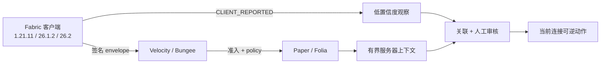

# MCAce（中文说明）

MCAce 是面向现代 Minecraft 网络的隐私优先信任、准入、证据与可逆处置栈。
发布面严格收窄为 Fabric 客户端 Mod、Velocity/BungeeCord 代理插件以及一个
Paper/Folia 后端插件。

> **v0.0.1 当前仍未放行。** 代码和服务端矩阵已在工作，但正式 tag 必须等
> 三版本可见 GUI 人工确认、真实服务器检测/拦截事件、真实 Vulcan genuine
> event、以及 Fabric federation source→target handoff 都在审查提交上留下证据。

[English README](README.md) · [发布门](docs/RELEASE_GATES.md) ·
[安全模型](docs/SECURITY.md) · [反作弊证据](docs/evidence/anti-cheat-real-server-2026-08-22.json)


## 产品边界与隐私契约

- Fabric 客户端 Mod：`1.21.11`、`26.1.2`、`26.2`。
- Velocity、BungeeCord 代理插件。
- Paper/Folia 后端插件。
- 默认 `MONITOR`；客户端来源事实只能观察，不能单独处罚玩家。
- 文件/截图证据必须经过可见、明确的人工同意。
- `DENY` 只作用于当前连接，可复核、可撤销；没有自动永久 BAN。
- 发布面不包含 launcher、agent、内核驱动、隐藏采集、键盘记录、摄像头/麦克风、
  任意封包利用或强制 Cloud 服务。

## 精确版本适配

兼容性是精确 tuple allowlist，不按协议号大小推断。


| Minecraft | 协议号 | Java | Fabric Loader | Fabric API | 客户端产物 |
| --- | ---: | ---: | --- | --- | --- |
| `1.21.11` | `774` | `21` | `0.19.3` | `0.141.6+1.21.11` | 最终 remap JAR |
| `26.1.2` | `775` | `25` | `0.19.3` | `0.155.2+26.1.2` | 最终 named JAR |
| `26.2` | `776` | `25` | `0.19.3` | `0.157.0+26.2` | 最终 named JAR |

当前真正验证的 `1.21.x` 只有 `1.21.11`，未列出的 patch 全部 fail-closed：

```powershell
.\scripts\version-compatibility-contract-smoke.ps1 -Execute
.\scripts\version-compatibility-contract-smoke.ps1 -ReportOnly `
  -ReportPath .\build\compatibility-contract\report.json
```

## 证据仪表盘

| 门 | 当前证据 | 状态 |
| --- | --- | --- |
| 根 + modern 严格离线测试 | 历史 exact 包 `171 suites / 755 tests / 0 failures / 0 errors`；[Helio 定向构建证据](docs/evidence/cluster-targeted-build-2026-08-22.json) 已成功运行 Fabric、Velocity、BungeeCord、Paper 与 runtime integration 测试 | 在已记录源码边界内通过 |
| Paper/Folia × Velocity/Bungee 进程矩阵 | [`server-version-process-matrix-2026-08-22.json`](docs/evidence/server-version-process-matrix-2026-08-22.json)：`12/12`、六棵精确版本树、清理为零；sidecar 绑定的是 README 修改前的 tree | 记录快照通过，发布重绑待做 |
| Fabric GUI consent | 1.21.11 已到可见显式文件授权页；未记录人工点击，因此没有生成发布证据 | 待 6 次人工确认 |
| 反作弊检测 | [`anti-cheat-real-server-2026-08-22.json`](docs/evidence/anti-cheat-real-server-2026-08-22.json)：真实 Leaf 1.21.11 + GrimAC `2.3.74-155abaf` 产出 `SERVER_CONFIRMED` 的 `Simulation`/`TickTimer` 事件，并完成两次 HTTP `202` 风险上传 | 真实检测/拦截上传 PASS；`MONITOR`/`NONE` 是有意保持，未执行惩罚动作 |
| Vulcan | 静态契约通过；当前工作区没有 licensed JAR 和 genuine 外部触发 | 待做 |
| Fabric federation | V2 静态契约通过；真实 source export/target import GUI handoff 尚未执行 | 待做 |
| exact-commit CI/release | 已记录的 canonical `main` 运行 [`32565146051`](https://github.com/TypeThe0ry/MCAce/actions/runs/32565146051) 已在不可变提交 `657a8ac8974addc0dbbfbd6c7d637792325e884d` 通过；[最终证据记录](docs/evidence/release-bundle-2026-08-22-final.json)固定八项 exact 包、`release_identity=true` 和 `SHA256SUMS` 核验 | 该精确提交 PASS；后续文档提交在打 tag 前需重新跑 canonical CI；外部 v0.0.1 门关闭前产品版本仍为 `0.1.0-SNAPSHOT` |

规范发布证据绑定到上面的不可变提交
`657a8ac8974addc0dbbfbd6c7d637792325e884d`。任何 checkout 都要用
`git rev-parse HEAD` 校验；只有 `release-manifest.properties` 中
`release_identity=true` 且 `source_commit` 与 checkout 完全一致时，才允许把包放进 tag。
当前 v0.0.1 放行仍由六次 GUI 人工确认、真实反作弊、Vulcan 和 federation 门共同决定。


## 反作弊与特征检测

检测管线严格区分来源和置信度：

1. `CLIENT_REPORTED` 的 Mod/资源包事实只是低置信度观察。
2. 签名、nonce、sequence、expiry、replay、scope 检查拒绝伪造或过期证据。
3. 只有配置的 provider 和时间窗口共同佐证时，关联器才产生 review 信号。
4. 高影响动作必须由 `SERVER_CONFIRMED` producer 或持久化管理员授权触发；客户端加载
   不是检测/拦截结果。

受控 fixture 只读 metadata，不执行第三方代码：

```powershell
.\scripts\anticheat-fixture-smoke.ps1 -Execute `
  -MinecraftVersion 1.21.11 `
  -MeteorJar 'C:\fixtures\meteor-client.jar' -MeteorSha256 '<sha256>' `
  -XrayPack 'C:\fixtures\Spectator_Xray_1.2.1.zip' -XraySha256 '<sha256>'
```

耐久真实客户端记录只证明客户端发现/资源加载，并明确写出
`real_server_connection=false`、`real_server_detection_event=false`、
`real_server_enforcement_exercised=false`。因此当前不宣称检测 precision、kick/DENY
效果或 BAN 效果。

## 构建与测试

根模块使用 JDK21，modern 客户端使用 JDK25；严格离线并启用依赖校验：

```powershell
$env:JAVA_HOME = '<JDK 21 路径>'
.\gradlew.bat clean build localVerificationBundle `
  "-PmcaceSourceCommit=$(git rev-parse HEAD)" `
  "-PmcaceModernJavaHome=<JDK 25 路径>" `
  --offline --dependency-verification=strict --rerun-tasks `
  --no-build-cache --no-configuration-cache --no-daemon `
  --no-parallel --max-workers=1 --console=plain
```

服务端权威矩阵：

```powershell
.\scripts\server-version-process-matrix.ps1 -Execute
.\scripts\server-version-process-matrix.ps1 -ReportOnly
```

为减少本机占用，编译/测试通过 cluster-orchestrator 分发。最近一次远端任务运行在
**Helio**（Windows、JDK21、RTX 4070 主机），显式使用 Gradle
`-Xmx2G -XX:TieredStopAtLevel=1`，约 3 分 50 秒完成，退出码 0。对应的脱敏记录见
[cluster-targeted-build-2026-08-22.json](docs/evidence/cluster-targeted-build-2026-08-22.json)。远端使用审查提交的
tree-equivalent 快照；凭据和 worker 路径不会写入仓库。

## 三版本 GUI 人工门

每个目标需要两次可见决定：显式文件授权，以及单独的 `GAME_RENDER_FRAME` 证据授权。
脚本等待真人点击并记录页面阶段、决定、产物 hash、清理和 binding，不模拟输入：

```powershell
$env:JAVA_HOME = '<目标对应的 JDK21 或 JDK25>'
.\scripts\platform-load-smoke.ps1 -FabricTarget 1.21.11 -WithFabricEvidence
.\scripts\platform-load-smoke.ps1 -FabricTarget 26.1.2 -WithFabricEvidence
.\scripts\platform-load-smoke.ps1 -FabricTarget 26.2 -WithFabricEvidence
```

成功后用脚本输出的 report/binding hash 做 `-ReportOnly`；超时报告是诊断记录，不能升级成发布证据。

## Vulcan 与 federation

Vulcan 需要操作者提供 licensed JAR、当前源码结构预检、隔离 Paper enablement，以及一次
外部真实触发的 genuine event。MCAce 不下载、不打包该授权产物；genuine-event wrapper
拒绝 synthetic event injection，只保存脱敏证据。

Federation 需要 source export consent、source disconnect、直接连接 target、target import
consent、subject binding、expiry 观察，以及零残留进程/端口。静态测试不等于真实 handoff。

## 发布产物

精确分发包固定为 8 项：六个可部署 JAR、`release-manifest.properties`、`SHA256SUMS`。
hash 必须来自干净 exact-commit `releaseBundle`，不要把旧构建 hash 粘进 release note。
当前记录的包仍携带 Gradle `product_version=0.1.0-SNAPSHOT`；在外部发布门全部
关闭前，不把 `v0.0.1` 标签提升为正式 tag。

| 文件 | 作用 |
| --- | --- |
| `mcace-client-fabric-1.21.11.jar` | Fabric 1.21.11 客户端 |
| `mcace-client-fabric-26.1.2.jar` | Fabric 26.1.2 客户端 |
| `mcace-client-fabric-26.2.jar` | Fabric 26.2 客户端 |
| `mcace-server-velocity.jar` | Velocity 代理插件 |
| `mcace-server-bungeecord.jar` | BungeeCord 代理插件 |
| `mcace-server-paper.jar` | Paper/Folia 后端插件 |
| `release-manifest.properties` | exact source/runtime 身份 |
| `SHA256SUMS` | 权威 JAR hash |

## 架构



## 目录

| 模块 | 职责 |
| --- | --- |
| `mcace-protocol` | wire contract、签名、重放防护 |
| `mcace-core` | session、policy、risk、disposition、federation |
| `mcace-client-common` | loader-neutral 完整性/证据原语 |
| `mcace-client-fabric` | 1.21.11 客户端与 consent UI |
| `fabric-modern` | JDK25 official-namespace 客户端 |
| `mcace-server-velocity` / `mcace-server-bungeecord` | 代理适配器 |
| `mcace-server-paper` | Paper/Folia 适配器 |
| `scripts/` | 构建、资产、兼容性与证据 gate |

更多资料：[架构](docs/ARCHITECTURE.md)、[运行](docs/OPERATIONS.md)、[平台测试](docs/PLATFORM_TESTING.md)、
[发布门](docs/RELEASE_GATES.md)、[安全](docs/SECURITY.md)、[federation](docs/FEDERATION.md)。
