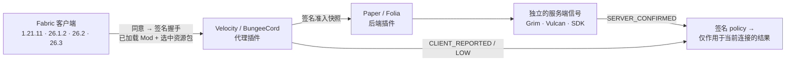

<div align="center">

# MCAce

**面向 Fabric + Velocity/BungeeCord + Paper/Folia 网络的“先征得同意”的反作弊层。**

客户端告诉服务端自己真正加载了什么；服务端拿自己的证据去核对；
签名 policy 决定怎么处理——每一步都有界、可复核、可撤销。

[](https://github.com/TypeThe0ry/MCAce/actions/workflows/build.yml)
[](https://github.com/TypeThe0ry/MCAce/releases/latest)
[](LICENSE)


[English](README.md) · [运维指南](docs/OPERATIONS.md) · [架构](docs/ARCHITECTURE.md) · [安全模型](docs/SECURITY.md) · [发布门禁](docs/RELEASE_GATES.md)

</div>

---

## 为什么做这个

大多数 Minecraft 反作弊只在服务端跑，靠移动包去猜客户端在干什么；
而客户端侧的“反作弊 Mod”往往是黑盒：玩家不知道它读了什么，服务端也没法证明回报没被伪造。

MCAce 站在两者中间。一个很小的 Fabric Mod 在**每次连接**时先征求玩家同意，
然后上报一份窄而有签名的客户端快照：实际加载了哪些 Mod、选中了哪些资源包 / Shader 包，
以及少量有界的纹理观察。代理和后端插件校验这份快照，与服务端自己的信号
（Grim、Vulcan 或你自己的检测）做关联，再执行管理员签过名的 policy。

它刻意**不是**：内核驱动、常驻代理、内存扫描器、随时截图的监视器，或自动封号机器。
已发布版本的处置上限是 `MONITOR`——MCAce 负责记录，人来做决定。

## 工作原理


```mermaid
flowchart LR
  C[Fabric 客户端<br/>1.21.11 · 26.1.2 · 26.2 · 26.3]
  P[Velocity / BungeeCord<br/>代理插件]
  B[Paper / Folia<br/>后端插件]
  S[独立的服务端信号<br/>Grim · Vulcan · SDK]
  R[签名 policy →<br/>仅作用于当前连接的结果]

  C -->|"同意 → 签名握手<br/>已加载 Mod + 选中资源包"| P
  P -->|"签名准入快照"| B
  B --> S
  S -->|"SERVER_CONFIRMED"| R
  P -->|"CLIENT_REPORTED / LOW"| R
```

1. **读取。** 玩家点击 *Enable MCAce* 后，客户端读取 Fabric Loader 的真实运行时图
   （`FabricLoader.getAllMods()`）、当前选中的资源包 / Shader 包，以及一次有界纹理探测。
   不发送绝对路径，不发送文件内容，最多 2048 个按规范排序的 Mod ID。
2. **关联。** 代理校验签名、nonce、序列号、过期与重放，再把回报和服务端为**同一会话**
   独立产生的证据放在一起看。单独的客户端声明永远是 `CLIENT_REPORTED / LOW`，不能自我升级。
3. **处置。** 由管理员签名的 policy 决定结果。客户端来源的事实最多触发
   `OBSERVE`、`NOTICE`、`WARN` 或 `CHALLENGE`；更重的动作必须有独立的服务端确认，
   只作用于当前连接，并且可撤销。没有自动永久封禁。

精确边界见[检测与证据合同](docs/DETECTION_AND_EVIDENCE.md)和
[威胁模型](docs/THREAT_MODEL_AND_BYPASS_CN.md)。

## 玩家看到什么

Mod 启动时是**关闭**的，直到玩家为这次连接明确启用。拒绝、关闭界面、超时或断线
都会让 MCAce 保持关闭。同意不会跨重连保存。

| 客户端主菜单 | 已启用的会话 | 同意界面 |
| :---: | :---: | :---: |
|  |  |  |

*这些是仓库 smoke 过程中截取的真实 Minecraft 窗口，不是效果图。截图只是视觉佐证；
真正的证据是签名后的 JSON、日志和哈希。*

## 支持的版本

MCAce 为每个客户端产物固定**精确**的 Minecraft 补丁版本、协议号和 Fabric API。
未列出的版本直接拒绝加载，而不是“大概能用”。

| Minecraft | 协议 | Java | Fabric Loader | Fabric API | 服务端通道 |
| :-- | --: | --: | :-- | :-- | :-- |
| `1.21.11` | 774 | ≥ 21 | ≥ 0.19.3 | `0.141.6+1.21.11` | Paper + Folia · 稳定 |
| `26.1.2`  | 775 | ≥ 25 | ≥ 0.19.3 | `0.155.2+26.1.2`  | Paper + Folia · 稳定 |
| `26.2`    | 776 | ≥ 25 | ≥ 0.19.3 | `0.157.0+26.2`    | Paper 稳定 · Folia 测试版 |
| `26.3`    | 777 | ≥ 25 | ≥ 0.19.3 | `0.161.0+26.3`    | Paper 测试版（实验通道，Folia 尚无对应版本） |

代理：Velocity 3.5.x / 4.2.x 与 BungeeCord。后端：Paper 与 Folia。
详见 [Fabric 兼容性](docs/FABRIC_COMPATIBILITY.md)。

## 快速开始

### 服主

1. 把 `mcace-server-velocity.jar` **或** `mcace-server-bungeecord.jar` 放进代理的 `plugins/`
   并启动一次。MCAce 会生成 Ed25519 身份，并把公钥写到
   `plugins/mcace/identity/server-public-key.txt`（Bungee 为 `plugins/MCAce/`）。
   `server-private-key.pk8` 绝不要外传。
2. 把 `mcace-server-paper.jar` 放进每个 Paper/Folia 后端的 `plugins/`，并把代理的**公钥**
   复制到 `plugins/MCAce/proxy-public-key.txt`。没有有效 pin，后端会拒绝启用。
3. 在读完[运维指南](docs/OPERATIONS.md)之前，`mcace.properties` 里保持
   `enforcement.mode=MONITOR`。`LIMITED_ROUTE` 需要两个不同且已注册的落地服务器。
4. 通过带外渠道（Discord、Wiki、启动器配置等）把公钥交给玩家。

常用管理命令（需要 `mcace.admin.audit` 权限）：

```text
/mcaceobservation inventory <uuid>          # 已加载 Mod / 资源包数量 + 回执新鲜度
/mcaceobservation freshness <uuid> [秒数]   # FRESH | STALE | CLOCK_ANOMALY | UNAVAILABLE
```

### 玩家

1. 把与你 Minecraft 版本匹配的客户端 JAR 和上表列出的 Fabric API 放进 `mods/`。
2. 创建 `.minecraft/config/mcace/server-keys.properties`：

   ```properties
   play.example.net=服务器提供的BASE64公钥
   ```

   地址必须与服务器列表里的写法完全一致。pin 缺失或错误时 MCAce 只是保持关闭——
   它永远不会响应未 pin 的服务器。
3. 进服。如果同意界面上描述的内容，点击 **Enable MCAce**。流程就这么多。

## 发布状态

**当前版本：[v0.0.1](https://github.com/TypeThe0ry/MCAce/releases/tag/v0.0.1)**
——`1.21.11` / `26.1.2` / `26.2` 共六个 JAR，由受保护的 CI 从 `1007e55` 构建，附带校验和。
`26.3` 客户端和 14 用例的服务端矩阵在之后合入了 `main`，会随下一个 tag 发布。

MCAce 把*核心合同*（能构建、能运行、能校验）和*扩展认证轨道*分开，后者需要仓库之外
持有的密钥签署证据。扩展轨道上的任何门禁都不会被 fixture、历史通过记录或调用方布尔值关闭；
在真实证据出现之前，每个门禁都保持 fail-closed。

| 门禁 | 证明什么 | 状态 |
| :-- | :-- | :-- |
| 受保护的精确发布包 | 受保护 CI 重建了精确的发布包，所有哈希一致 | ✅ 通过 |
| 服务端版本矩阵（V4） | 14 个真实 Paper/Folia × Velocity/Bungee 进程用例，外部监督签名 | ✅ `28e4bb6` 已通过 |
| GUI 同意见证 | 一次真人可见的 *Enable MCAce* 点击，GUI 签名并绑定 PNG | ⏳ 待完成 |
| Federation V5 交接 | 代理到代理的交接继承该同意，不出现第二次提示 | ⏳ 待完成 |
| Vulcan V3 真实事件 | 授权版 Vulcan 触发一次真实（非合成）的 provider 事件 | ⏳ 待完成 |
| Production Authority V4 | 后端→代理的签名权限链端到端捕获 | ⏳ 待完成 |

完整账本——以前堆在 README 里的每一次带日期的运行、哈希和限定说明——归档在
[`docs/evidence/README_CN_STATUS_LEDGER_2026-09.md`](docs/evidence/README_CN_STATUS_LEDGER_2026-09.md)。
门禁定义见[发布门禁](docs/RELEASE_GATES.md)。

## 构建

根模块使用 JDK 21；`26.x` 客户端在独立的 JDK 25 项目中构建。
依赖校验是严格模式，构建应当可以离线完成。

```powershell
$env:JAVA_HOME = '<JDK 21 home>'
.\gradlew.bat clean build localVerificationBundle `
  "-PmcaceProductVersion=0.0.1" `
  "-PmcaceSourceCommit=$(git rev-parse HEAD)" `
  "-PmcaceModernJavaHome=<JDK 25 home>" `
  --offline --dependency-verification=strict
```

在本地完整跑一遍——代理、后端，加一个带同意界面的真实 Fabric 客户端：

```powershell
.\scripts\platform-load-smoke.ps1 -FabricTarget 26.2 -WithFabricEvidence
```

更多见[平台测试](docs/PLATFORM_TESTING.md)和[运行时测试](docs/RUNTIME_TESTING.md)。

## 仓库结构

| 模块 | 内容 |
| :-- | :-- |
| `mcace-protocol` | 线路格式、签名、规范编码、防重放 |
| `mcace-core` | 会话、准入、policy、风险、处置、federation |
| `mcace-client-common` | 与加载器无关的完整性扫描、Loaded ModList 模型、同意原语 |
| `mcace-client-fabric` | Fabric 1.21.11 客户端（JDK 21） |
| `fabric-modern` | Fabric 26.1.2 / 26.2 / 26.3 客户端（JDK 25） |
| `mcace-server-velocity` · `mcace-server-bungeecord` | 代理插件 |
| `mcace-server-paper` | Paper/Folia 后端插件与 provider 适配 |
| `mcace-runtime-integration` | 真实进程测试框架与端到端测试 |
| `scripts/` | fail-closed 的构建、smoke、矩阵、证据与就绪度工具 |
| `docs/` | 设计文档与证据归档 |

## 文档

- [运维指南](docs/OPERATIONS.md)——安装、pin、policy、命令
- [架构](docs/ARCHITECTURE.md) · [产品范围](docs/PRODUCT_SCOPE.md)
- [检测与证据](docs/DETECTION_AND_EVIDENCE.md) · [检测目录](docs/DETECTION_CATALOG.md)
- [客户端完整性 policy](docs/CLIENT_INTEGRITY_POLICY.md) · [清单准入](docs/INVENTORY_ADMISSION.md)
- [威胁模型与绕过边界](docs/THREAT_MODEL_AND_BYPASS_CN.md)（[English](docs/THREAT_MODEL_AND_BYPASS.md)）
- [安全模型](docs/SECURITY.md) · [服务端确认权限](docs/SERVER_CONFIRMED_AUTHORITY.md)
- [Federation](docs/FEDERATION.md) · [行为检测集成](docs/BEHAVIOR_INTEGRATIONS.md)
- [发布门禁](docs/RELEASE_GATES.md) · [服务端版本矩阵证据 V4](docs/SERVER_VERSION_MATRIX_EVIDENCE_V4.md)

## 许可证

[MIT](LICENSE) © 2026 Ellan
