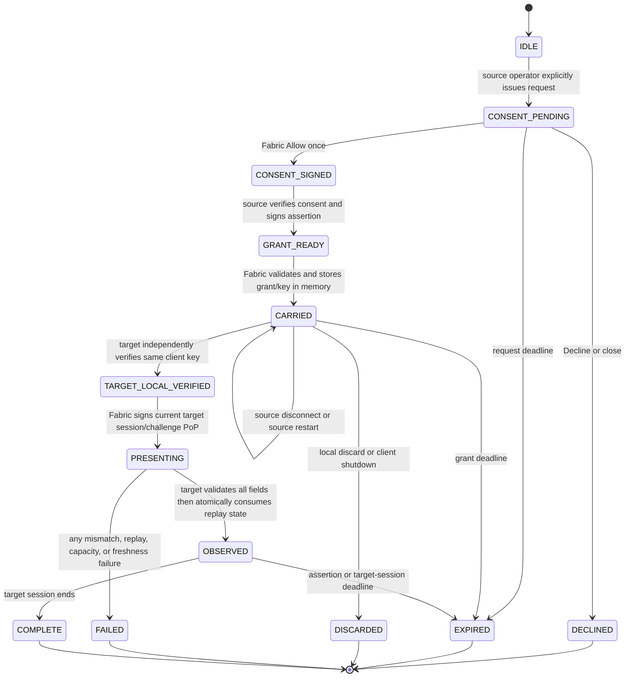

# Client-carried federation security contract

## Status and scope

MCAce federation is an optional, disabled-by-default path for carrying one
minimal source-network observation to one explicitly named target network:

```text
source operator -> source proxy -> Fabric Mod -> target proxy
```

There is deliberately no source-to-target control channel, HTTP endpoint,
socket, callback, live peer session, token broker, Cloud dependency, or
target-to-source redemption. The Fabric Mod carries a signed grant in bounded
memory. Neither proxy discovers peers or keys from the network.

The only remote claim is `FEDERATION_SOURCE_LOCALLY_VERIFIED`: the pinned source
says that it locally verified the named player/session when it issued the grant.
This enum is not `TrustLevel.VERIFIED`. The target must already have completed
its own local MCAce authentication as `VERIFIED` before it accepts a
presentation, and the remote claim cannot change trust, risk, policy,
disposition, routing, messages, disconnects, bans, or evidence handling.

Federation does not disclose risk scores or reasons, manifests, mod/resource
lists, evidence, screenshots, devices, IP addresses, file paths, or arbitrary
operator notes. Decline, expiry, failure, missing state, or unsupported behavior
is availability-only telemetry and cannot punish the player.

## Four-message protocol

Every message has a distinct packet type and fixed direction:

| Step | Packet type | Direction | Payload and effect |
| --- | --- | --- | --- |
| 1 | `FEDERATION_CONSENT_REQUEST` (17) | source server -> client | Operator-initiated, target-specific disclosure request; allocates no grant |
| 2 | `FEDERATION_CONSENT_RESPONSE` (18) | client -> source server | Ed25519-signed `Allow once` response; absence means decline/close/timeout |
| 3 | `FEDERATION_GRANT` (19) | source server -> client | Client consent plus source-signed assertion and the short-lived client session public key |
| 4 | `FEDERATION_PRESENTATION` (20) | client -> target server | Complete grant plus fresh target-session proof of possession |

Partial messages, a grant sent directly to a target, a presentation without its
proof, and any message in the wrong direction fail closed to federation
unavailable. Normal MCAce signed-envelope/session checks remain mandatory on
each local proxy-client hop.

The target never asks the source to issue, redeem, confirm, revoke, or refresh a
grant. Only an authorized source operator starts step 1. This prevents joining a
target, a target plugin, or a third-party relay from silently causing a source
disclosure prompt.

## Signed bindings

The consent request, client consent, and source assertion bind the same exact:

- schema version;
- source and target network IDs;
- source and target Ed25519 identity-key SHA-256 fingerprints;
- canonical player UUID;
- short-lived client session public-key SHA-256;
- source locally authenticated session ID;
- assertion UUID and 32-byte assertion nonce;
- issue time and expiry, with a lifetime no longer than five minutes;
- policy version and 32-byte policy hash;
- disclosure fixed to `source_locally_verified`.

The client signature covers the canonical consent with its signature field
cleared. Changing the target, either identity fingerprint, disclosure, expiry,
policy, player, session, assertion ID, or nonce invalidates it. The source
assertion includes the SHA-256 of the complete signed consent, and the source
Ed25519 signature covers the canonical assertion. Unknown schema versions,
unknown enum values, unknown signed fields, malformed identifiers, noncanonical
UUIDs, oversized encodings, unsafe time arithmetic, and partial bindings are
rejected as a whole.

The grant contains no new authority. It packages the signed consent, signed
assertion, and source-session client public key. A client validates the grant
against its original pending request, its current client key, and the pinned
source identity before retaining it.

## Offline reciprocal pin model

Reciprocal pinning means two independent offline configuration decisions, not a
live reciprocal connection:

- the source operator configures the exact target network ID and target identity
  key fingerprint that may appear in a consent request;
- the target operator configures the exact source network ID and source identity
  key fingerprint it will accept in a presentation.

DNS, TLS, discovery, a display name, trust-on-first-use, wildcard peers,
transitive trust, or a pin configured only on the other network is insufficient.
The source copies both key IDs into the signed request/assertion. The target
checks the source key against its pin and the target key against its own current
identity key. A same-name network with a different key therefore cannot reuse
consent or act as the audience.

Key rotation requires explicit offline configuration on both sides and a new
visible player consent. Removing a local target-side source pin prevents future
acceptance immediately after the local configuration reload. Removing a source
pin cannot remotely revoke an already signed grant because no control channel
exists.

## Player consent and Fabric vault

Before signing step 2, Fabric displays a real in-game prompt containing:

- exact source and target network names/IDs;
- short source and target key fingerprints;
- the single disclosed statement, in plain language;
- the exact expiry and the five-minute maximum;
- that the statement is observation-only and cannot replace local verification;
- equally clear `Allow once` and `Decline` actions;
- that decline, close, timeout, or failure causes no automatic action.

There is no `Always allow`, preselected approval, gameplay-key shortcut, inferred
approval, or approval inherited from server terms. Closing the prompt produces
no signed response. A request changed after display is not the request the
player approved.

After validating a grant, Fabric keeps only the grant and the associated
short-lived source-session private key in a bounded in-memory vault. This is a
session credential, not a device identifier. It is never written to disk,
config, log, chat, URL, audit, clipboard, or server-list metadata. The vault is
cleared on successful presentation, explicit local discard, expiry, client
shutdown, or bounded-capacity rejection.

The vault intentionally survives disconnect from the source after the complete
grant has been received. Source disconnect or source proxy restart does not
invalidate the signed grant. This makes the client-carried handoff possible
without a live peer channel. A grant that was not delivered before source
disconnect is unavailable.

## Target-local authentication and proof of possession

The target accepts a presentation only after the player has independently
completed a local authenticated MCAce session with `TrustLevel.VERIFIED`. Phase
one uses the same short-lived client key from the Fabric vault for the target
handshake; the target compares its authenticated session key hash with the hash
inside the consent and assertion. A different target-session key makes
federation unavailable and does not affect the local authentication result.

After local authentication, Fabric signs a fresh
`FederationPresentationProof` with the retained source-session private key. The
proof binds:

- SHA-256 of the complete signed assertion wrapper;
- assertion ID;
- exact target network ID and player UUID;
- current target authenticated session ID;
- current target 32-byte server challenge;
- presentation time within the short proof-freshness window.

The target verifies the proof using `grant.client_public_key_x509`, verifies that
key's SHA-256 against the signed consent/assertion and its current authenticated
client session, and verifies the expected current session, player, challenge,
audience, target identity key, source pin, assertion time, and policy bindings.
A captured grant is therefore not a usable bearer credential without the
retained private key, and a captured complete presentation is bound to one
target session/challenge.

Replay state is consumed atomically only after size, parse, both signatures,
both network keys, all consent/assertion bindings, audience, player, time, local
session, challenge, and PoP are valid. Invalid traffic cannot pre-consume an
assertion ID/nonce to deny the legitimate presentation. Replay storage is
bounded globally and one-time per source/target/assertion scope.

## Executable state model



| State/input | Required guard | Effect |
| --- | --- | --- |
| `IDLE -> CONSENT_PENDING` | Authorized source operator; enabled offline target pin; live source local session; bounded request capacity | Show one prompt; create no assertion |
| `CONSENT_PENDING -> CONSENT_SIGNED` | Exact unexpired request and explicit `Allow once` | Sign one response with the bound client key |
| `CONSENT_SIGNED -> GRANT_READY` | Source verifies client signature, pending request, local session, both configured key IDs, time, and local verification | Sign only `FEDERATION_SOURCE_LOCALLY_VERIFIED` |
| `GRANT_READY -> CARRIED` | Fabric verifies source signature, consent signature, consent hash, all bindings, original request, key, audience, and time | Store bounded grant/key only in memory |
| `CARRIED -> TARGET_LOCAL_VERIFIED` | Target independently returns local `VERIFIED` using the same short-lived client key | Preserve local trust; make PoP possible |
| `TARGET_LOCAL_VERIFIED -> PRESENTING` | Current target session ID and fresh server challenge available | Sign one complete presentation proof |
| `PRESENTING -> OBSERVED` | All validation succeeds and replay accept wins atomically | Install bounded remote-observation summary only |
| Any error/absence | Bounds, capacity, direction, pin, signature, time, session, challenge, player, or replay failure | Install nothing; do not alter local player state |

Only bounded pending requests, grants, and replay entries are retained. Capacity
failure does not evict an unrelated player's valid local security session and
does not become a risk signal.

## Expiry, disconnect, restart, and revocation semantics

There is no immediate remote revocation after a grant is signed. This is an
explicit tradeoff of having no source-target channel.

| Event | Defined behavior |
| --- | --- |
| Player declines/closes/times out | No consent, assertion, or grant exists; no player consequence |
| Source disconnect before grant delivery | Flow unavailable; Fabric has nothing to carry |
| Source disconnect/restart after grant delivery | Fabric may present the unchanged grant until its signed expiry |
| Source operator disables target after signing | Prevents new source issues after local reload; cannot recall grants already in client memory |
| Player locally discards before presentation | Fabric destroys grant/key; target receives nothing |
| Target source-pin removal/key rotation | Target rejects later presentations after local reload |
| Target player disconnect | Target removes the in-memory observation; the local grant is normally burned after successful use |
| Client shutdown | Fabric vault disappears; no disk recovery |
| Grant/assertion expiry | Target rejects it; all local holders sweep it |
| Target restart | Target observation and in-memory replay guard disappear; new local authentication/session/challenge are required |

Because replay state is target-process memory, a target restart loses consumed
assertion IDs. An honest Fabric client has already burned a successfully used
grant, and an old complete presentation cannot match the new target
session/challenge. A malicious client that retained an unexpired grant and its
private key could authenticate again and create a new proof after restart. The
result remains observation-only, but this is a real residual replay window until
the signed grant expires. Durable replay coordination would be a separate,
explicitly designed feature; phase one does not claim it.

Similarly, the source cannot issue an instant remote invalidation after signing.
Short lifetime, target-local authentication, exact pins, current-session PoP,
in-memory client cleanup, and the no-enforcement effect ceiling are the controls.

## Content-free audit

Allowed audit data is limited to bounded lifecycle metadata: local event ID,
operator identity for explicit issue, player UUID or local pseudonym, source and
target IDs and short key fingerprints, assertion ID or local digest, schema and
policy versions, state transition, stable outcome code, issue/expiry/event times,
and validation result.

Audit must not contain the grant or presentation bytes, signatures, private or
public key encodings, nonce/challenge values, raw policy hashes, mod/resource
data, risk data, evidence, IP addresses, paths, screenshots, or free-form player
content. Audit failure may make federation unavailable but cannot alter local
trust/admission/risk/disposition.

## Threat matrix

| Threat | Control | Safe result / residual |
| --- | --- | --- |
| Same-name or redirected network | Both key fingerprints signed; source and target use offline exact pins | Mismatch rejected before observation |
| One-sided, wildcard, or transitive trust | Independent local configuration; no discovery/default peer | Unconfigured flow unavailable |
| Silent target-triggered disclosure | Only authorized source operator may issue request | Target cannot cause prompt by joining/callback |
| Consent reuse for another target/expiry/policy | Client signature covers every request binding | Grant construction/verification fails |
| Mixed consent and assertion | Source assertion binds full signed-consent hash; all common fields compared | Whole grant rejected |
| Forged source claim | Ed25519 assertion signature and pinned source key ID | Whole grant/presentation rejected |
| Stolen grant | Target-session PoP by retained source client key | Grant alone is insufficient |
| Capture-first presentation race | PoP binds current target session, player, challenge, and assertion | Other session/challenge fails without consuming replay |
| Replay after success | Final atomic bounded replay accept | Same assertion rejected in that target process |
| Invalid packet consumes nonce first | Replay mutation occurs only after all checks | Legitimate presentation remains usable |
| Clock rollback/overflow | Signed issue/expiry, <=5-minute lifetime, bounded skew, checked arithmetic | No lifetime extension through arithmetic bypass |
| Parser/unknown-enum bomb | Pre-parse byte cap and strict version/enum/unknown-field checks | Bounded unavailable result |
| Source disconnect/restart | Complete signed grant is client-carried | Grant remains valid only to original <=5-minute expiry |
| Source wants immediate revoke | No live channel exists | No immediate revoke; expiry/effect ceiling are explicit residual controls |
| Target restart | New local session/challenge invalidates old presentation | Consumed-grant memory loss leaves residual re-presentation window described above |
| Remote claim promoted to local trust | Separate enum/result and target local-`VERIFIED` prerequisite | Remote data cannot create local verification |
| Remote absence/error used to punish | No risk/disposition/admission integration | No player effect |
| Audit becomes tracking store | Content-free allowlist and negative scanning | Reviewable lifecycle without client artifacts |

## Release and test matrix

| ID | Required test | Passing evidence |
| --- | --- | --- |
| `FED-PROTO-01` | Four distinct packet types and exact directions | Wrong-direction and partial messages rejected |
| `FED-BIND-01` | Source/target IDs and key IDs, player, client key, source session, assertion ID/nonce, policy, disclosure, issue/expiry | Every one-field mismatch rejected |
| `FED-CONSENT-01` | Real Fabric `Allow once`, decline, close, timeout | Fingerprints/fields/expiry visible; only explicit allow signs; all other outcomes have no player effect |
| `FED-GRANT-01` | Valid grant and mixed-consent/assertion, wrong source key, stale, oversized, unknown enum/field | Only exact pinned grant enters Fabric vault |
| `FED-LOCAL-01` | Target local unknown/failed/missing vs local `VERIFIED` | Presentation accepted only after independent local `VERIFIED`; remote state never changes result |
| `FED-POP-01` | Wrong target/player/session/challenge/key, tampered proof, stale proof | Rejected; valid presentation still succeeds afterward |
| `FED-POP-02` | Capture-first race | Captured data for another session/challenge cannot consume replay or install observation |
| `FED-REPLAY-01` | Two concurrent valid presentations | Exactly one atomic winner in one target process |
| `FED-REPLAY-02` | Target restart while malicious client retains unexpired grant | Old target-session PoP is rejected; a newly signed target-session PoP is deliberately re-observed after the in-memory target replay guard is lost. This is an explicit bounded residual, not durable replay protection and has no enforcement effect. |
| `FED-TIME-01` | Expiry, >5-minute TTL, future issue, excess skew, overflow/rollback | Strict bounded failure |
| `FED-PIN-01` | Missing/wrong/rotated source or target offline pin | No accepted grant/presentation; no local player effect |
| `FED-PRIV-01` | Logs/audit/config/disk scan | No grant, nonce, challenge, private key, evidence, manifest, risk, IP, or path leakage |
| `FED-VAULT-01` | Use, expiry, discard, capacity, client shutdown; source disconnect after delivery | Clears on terminal cases; survives only intended post-delivery source disconnect |
| `FED-PROXY-01` | Velocity->Velocity, Velocity->Bungee, Bungee->Velocity, Bungee->Bungee | Explicit source issue through target observation with exact pins and process cleanup |
| `FED-E2E-01` | Real Fabric source/target transition | GUI consent, grant carry, independent target verification, one PoP presentation, expiry/cleanup recorded |
| `FED-ISOLATE-01` | Add/remove valid/invalid/missing federation data around every local policy action | Trust, risk, disposition, route, message, disconnect, ban, and evidence behavior unchanged |

Unit tests prove protocol mechanics, not the real Fabric GUI or four proxy-pair
runtime gates. Federation remains disabled by default with empty peer pins until
the applicable integration rows pass.

### Opt-in target-restart residual gate

The separate `FED-REPLAY-02` process gate runs only when explicitly requested:

```powershell
.\scripts\federation-target-restart-residual-smoke.ps1
```

It is intentionally **not** part of an ordinary Gradle build or the four-pair
proxy matrix. The gate starts a Velocity source and Velocity target with pinned
identities, obtains a source-operator-issued grant through the test-only raw
peer, closes the source client connection, then completes target-local
`VERIFIED` and observes the first presentation. It terminates **only** the
target proxy JVM, verifies that the original target identity and federation
configuration remain byte-for-byte unchanged while Paper stays alive, and starts
a new target proxy process from the same root.

The proxy fixture deliberately keeps its own target identity and configuration
on disk until the restart comparison is complete, then deletes its temporary
proxy private keys during final cleanup. Separately, the harness retains the
validated grant and source-session private key only in private test-process
memory to model a malicious client; it never writes, logs, reports, or exposes
either retained value. On the new target local session it first wraps the old
inner proof in a fresh local outer envelope. That old proof must be rejected
because it binds the first target session/challenge. The harness then signs a
new PoP with the still-unexpired retained grant and the new target
session/challenge. The expected current result is `OBSERVED`, because the target
replay guard is intentionally process-memory-only and was cleared by the proxy
restart. The generated content-free report records
`residual_reacceptance=true`, local `VERIFIED`/risk `0`/Paper admission invariants,
and owned-process cleanup. It never contains signed frames, grants, keys,
sessions, nonces, challenges, hashes, evidence, or forwarding secrets.

This verifies and honestly records the residual; it does **not** add persistence
to the replay guard, change production replay semantics, make the source
reachable from the target, or turn remote observation into risk, admission,
routing, punishment, or evidence behavior. It is a raw-wire test peer only, so
it does not claim Fabric GUI consent coverage.

## Implementation order

1. Keep the versioned, bounded four-message protocol and attack corpus green.
2. Add source operator issue state, offline peer pins, bounded content-free audit,
   and no target-triggered source path.
3. Add Fabric `Allow once`, grant verification, in-memory grant/key vault, target
   key reuse, PoP creation, and terminal cleanup.
4. Add target local-`VERIFIED` prerequisite, exact pin/session/challenge verifier,
   bounded replay guard, and a remote-observation-only store isolated from every
   enforcement path.
5. Run the real GUI, proxy-pair, restart/residual-replay, privacy, and
   noninterference gates before enabling the feature.

No phase may introduce a Launcher, Agent, desktop client, Cloud dependency,
silent disclosure, source-target network service, or remote enforcement.
