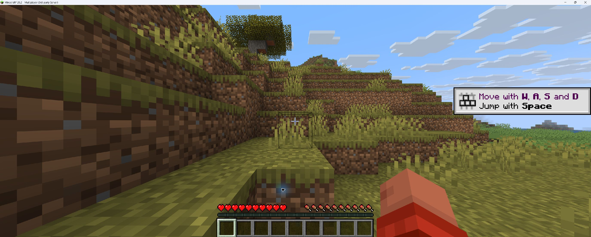

# Native Fabric runtime check — 2026-09-08

This is a diagnostic record, not a Federation V5 release attestation.

## Source and environment

- Checkout: `D:\Projects\MCAce`
- Tested source: `6baa7652d97ee70112403fd92213423b3ae7e45a`
- Artifact source: `2a6274a9200f2aa195e1238eaddf43650f549a0a`
- Fabric target: `26.2`, Java 25; root dependency staging: Java 21.
- Client JAR SHA-256: `0680a528c38d9f456363488e80ea390615b5ba289714790583a434e2c95b0fe9`
- Isolated run: `build/fabric-federation-gui-handoff/evidence-runs/20260908T013959279Z-26_2-VELOCITY-to-VELOCITY-1371f0ca92a474cf699f93ea6537c188`
- Source endpoint: `127.0.0.1:62737`; separate source/target Velocity and Paper processes.

GitHub push run 34142961977 and PR run 34142964242 both completed successfully
for the tested source. PR 17 remained open and draft. The existing readiness
report for this source passes the Matrix gate and remains release-blocked.

## Native GUI and runtime results

The Windows `@oai/sky` API successfully listed and captured the independent
Fabric window (window ID 34211558, application `D:\MCAceTools\jdk\jdk-25\bin\java.exe`).
The previous browser-only `apps=[]` observation is not a current limitation of
the native Windows API. The existing Ellan.TOP user client was left running.

At 09:45:19 local time, the client logged the signed-policy enablement request
and visible screen render. The operator-authorized Computer Use interaction
clicked **Enable MCAce** once at 09:47:04. At 09:47:05:

```text
CLIENT: MCAce explicit-file manifest prepared entries=1
CLIENT: MCAce answered signed policy phase2-v3 sequence 2 with 4 scoped manifests
CLIENT: MCAce session verified at trust level VERIFIED with risk score 0
VELOCITY: MCAce verified Player536 at trust=VERIFIED risk=0
VELOCITY: observations=53 actions={OBSERVE=53} advisoryBlocks=0 policyVersion=bootstrap-1 issues=0 status=ACTIVE truncated=false
VELOCITY: action=OBSERVE result=NO_VALID_POLICY authorization=none session-bound=true execution-context-bound=false
PAPER: admission=VERIFIED, trust=VERIFIED, risk=0
```

These excerpts are from the run's `fabric-client/logs/latest.log`,
`source-proxy/logs/latest.log`, and `source-paper/logs/latest.log`. They verify
the authenticated manifest upload, proxy observations and signed backend
admission synchronization. The aggregate count alone does not enumerate the
individual loaded mod IDs. No cheat mod or Xray pack was loaded in this run;
this run does not prove their detection or any kick/ban effect.



The screenshot is the actual post-click Computer Use observation. It shows
the game view after the consent screen closed; the log excerpts above provide
the authentication evidence.

## Findings and remaining work

The disclosure text extends below the viewport at both default and maximized
window sizes. Mouse scrolling successfully reveals the remaining paragraphs;
the initial impression of unreachable text was corrected by live scrolling.
A visible scroll affordance would make this clearer.

The release GUI signer requires `prompt_challenge_visible=true`. No challenge
value was visible in the inspected prompt, including its scrolled end. The
runner creates its GUI nonce in PowerShell, while the inspected enablement
paragraph renderer contains no matching challenge display. This needs a
source-to-render binding review before signing a release attestation. No such
assertion or signed attestation was produced in this diagnostic run.

The wrapper ended with exit code 1 and
`FABRIC_FEDERATION_GUI_EXTERNAL_SCREENSHOT_NOT_CREATED_IN_VISIBLE_WINDOW`.
The capture was kept as diagnostic output rather than submitted to the
release-signing exchange. The wrapper forcibly stopped its test client after
a graceful shutdown timeout and removed its failed run directory, including
the original logs and pre-click diagnostic capture. The log excerpts in this
record were read before cleanup; they are not a retained raw evidence package.
A final process inventory contained only the pre-existing user Java processes
44064 and 23900. The post-click image above was saved from the already observed
Computer Use result after cleanup.

Federation handoff, licensed Vulcan genuine callback, production authority
evidence and protected main/tag release CI remain pending. The final README
evidence edition and v0.0.1 publication remain gated on those results.

## Follow-up: retain failed-run diagnostics

The wrapper now retains a failed owned run directory after its existing process
and port cleanup. It creates `diagnostic-failure.json` with `status=failed` and
`release_eligible=false` instead of recursively deleting the run. This applies
to runtime/assertion failures and final evidence publication failures. The
original exception remains the terminal error even if marker creation fails.

Retained directories are local troubleshooting material and may contain test
keys and player metadata. Do not commit or upload them wholesale. Successful
evidence publication retains its existing exact-directory validation; the
failure marker is not an accepted release document. A late publication failure
may occur after the success-path raw directory clearing, so this change cannot
recover logs already removed at that earlier stage.

The native V5 regression suite verifies original log preservation, non-release
marking, create-new marker semantics, owned-directory enforcement and rejection
of the diagnostic directory by release evidence validation. The suite passed
with the existing host symbolic-link-permission coverage gap.

This wrapper change is release-affecting under the current artifact-source
contract. The old `2a6274a` bundle and its Matrix evidence remain historical
evidence for that source; a new artifact source, build and relevant runtime
evidence are required before release. Do not merely reuse the previous green
readiness result for the changed wrapper.

## Follow-up: visible challenge transport

The wrapper now passes its per-run GUI nonce as `mcaceSmokeGuiChallenge` to the
release-client Gradle launcher. Both the legacy and modern launch paths forward
it as `mcace.platform-smoke.gui-challenge` to the actual client JVM. The shared
`GuiEvidenceChallenge` formatter rejects anything except 64 lowercase hex
characters and displays all characters in four ordered 16-character lines at
the start of the enablement disclosure. Ordinary launches without this
property do not add test text. This display value does not authorize a session
or affect risk scoring.

Both Fabric renderers log the configured value through their one-shot render
callback. Before collecting the screenshot, the wrapper requires the matching
render marker. An actual screenshot still needs visual inspection: the log
marker alone is insufficient to attest that the complete challenge is visible.

Validation: shared formatter tests, legacy ExplicitFileConsentScreen tests,
modern 26.1.2/26.2 test tasks and the native V5 PowerShell contract suite passed.
The PowerShell suite retains its symbolic-link-permission coverage gap. A root
build initially failed when storing the pre-existing stage task configuration
cache; rerunning with `--no-configuration-cache` completed successfully.

The new challenge display still requires a rebuilt release JAR and a fresh
native GUI run. The earlier screenshot in this document predates this change
and cannot verify its appearance or its signed evidence chain.

## 5ccb9d6 runtime retry and controlled anti-cheat results

The rebuilt 26.2 JAR (`79283b790451670af85a0349a5c6592bcbb45cd071128c55b42b62f117e78060`)
loaded in the real Fabric client on source `5ccb9d62104817f4ff66d7087e5fcea0aff87142`.
At 10:09:08 local time its render callback logged the exact configured challenge
`d21b913e11ef83245c897d928b3f171234d665a71c78582c5f4e57b2e20e7e7a`.
An unrelated Windows firewall prompt for `cyc-controller.exe` covered the
client. Native input targeting rejected an attempted Minecraft maximize action
because the point belonged to `PickerHost.exe`. No firewall action was taken,
and no unobstructed challenge screenshot or GUI attestation was produced.

The wrapper ended with exit code 1 and
`FABRIC_FEDERATION_GUI_EXTERNAL_SCREENSHOT_NOT_CREATED_IN_VISIBLE_WINDOW`.
Its failed directory is retained locally at
`build/fabric-federation-gui-handoff/evidence-runs/20260908T020243638Z-26_2-VELOCITY-to-VELOCITY-f942800da5440031f0575b1c5901a6d1`.
The `diagnostic-failure.json` marker records `release_eligible=false`; the real
client log remains available. The test client required forced shutdown after
the graceful timeout. Final Java inventory matched the pre-run processes
44064, 23900 and 24116. The local directory may contain test credentials and
must not be uploaded wholesale.

While GUI work was obstructed, two controlled tests completed against the same
source:

- [Executable client/server fixture report](anticheat-live-20260908-5ccb9d6.json):
  all three protocol versions passed, 3 same-session SERVER_CONFIRMED events,
  signed lab policy action QUARANTINE, clean-client false-positive count 0.
  This uses an MCAce-owned executable fixture and loopback protocol harness;
  it does not launch third-party cheat code or a real Fabric client.
- [26.2 metadata classification report](anticheat-classification-20260908-5ccb9d6.json):
  3 tests passed, 2 client observations correlated with 2 server signals.
  The Meteor metadata and resource pack receive CLIENT_REPORTED / LOW /
  OBSERVE; the Xray fixture identifier is unknown. This does not establish
  automatic recognition of Xray textures or real-world cheat interception.

Report SHA-256 values respectively:
`cb8056b427da94d4f3d768ad129db9b6a1a57ac0d59dcacf7ae588ffa9e024f2`
and `e553f853b544ea619e6d40d80e9a7d029cdcbc7495719af6149362aeaf58a886`.
These are diagnostic reports, not substitute release attestations. Production
authority, genuine Vulcan callback and real federation handoff remain pending.

## Current-candidate runtime attempt and stale readiness repair

The bundle was rebuilt with source `9e5f280f06c0c9dacdb8b0379e7c830655565f71`
and artifact source `91ce31dc98ab4b0b0ccb09e534ca87a8a0c69688` before the next
26.2 Velocity-to-Velocity attempt. The new run was
`20260908T024253729Z-26_2-VELOCITY-to-VELOCITY-b99d1cc1c45a7b96658a72356c11ba7e`.

Both bootstrap proxies loaded MCAce 0.0.1. The source active process eventually
logged `Listening on /127.0.0.1:54954` and `Done (74.57s)!` at 10:48:20 local
time, but the wrapper failed its listener check and cleaned up. No Fabric
client or new Enable decision was reached. The retained directory is local-only
and may contain test keys; do not upload it wholesale. After cleanup, the Java
inventory contained the pre-existing Minecraft/server PIDs 44064 and 23900.
An unrelated Gaius Maven process was identified during diagnosis and not stopped.

The readiness helper read shared `logs/latest.log` and `proxy.log.*` along
with per-process output. Bootstrap readiness markers could therefore satisfy
the active-process wait early, starting a 60-second listener check before the
active JVM was ready. Its own stdout capture also buffered short writes.

The repair reads only the create-new stdout/stderr paths belonging to the
current process incarnation and disables FileStream buffering. It preserves
the existing marker deadlines, loopback-only check and owning-PID check.
Regression tests place stale ready markers in both rolling-log locations,
require them not to satisfy readiness, and verify a short current-process
write is visible before Flush/Dispose. The V5-contract tests passed under both
PowerShell Core and Windows PowerShell 5.1, with the explicitly reported
Windows symlink-permission coverage gap. This
repair still requires a fresh real runtime rerun; it is not a GUI acceptance.
